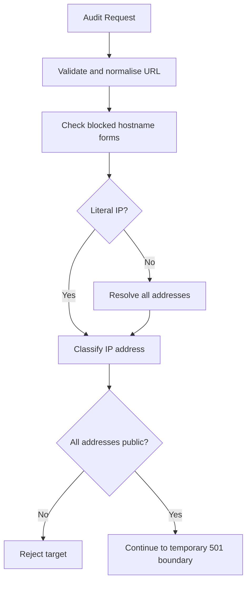

# PagePulse

PagePulse is a production-minded URL health and quality audit API being built for the Digital Heroes Software Development qualification task.

## Current Status

Phase 3 establishes destination-safety validation before any outbound request can be introduced. The API now validates and normalises audit URLs, blocks explicit unsafe hostnames, classifies literal IP addresses, resolves domain names through the operating-system resolver, and rejects any destination that does not resolve exclusively to public unicast addresses.

Remote page fetching and audit generation are not implemented yet. Caching, concurrency limits, rate limiting, CI, deployment, and the public demonstration interface are also not implemented yet.

## Technology Stack

- Node.js 22 LTS target
- Express
- JavaScript ES modules
- Zod
- Pino and pino-http
- Undici, installed for later audit HTTP work
- Vitest
- Supertest
- ESLint

## Prerequisites

- Node.js `>=22 <25`
- npm

## Local Setup

```bash
npm install
npm run check
npm start
```

The server listens on `PORT`, which defaults to `3000`.

For local development, copy the example environment file and run the watch-mode server:

```bash
cp .env.example .env
npm run dev
```

On Windows PowerShell:

```powershell
Copy-Item .env.example .env
npm run dev
```

`npm run dev` uses Node.js built-in `--env-file-if-exists=.env` support, so it loads `.env` when present and still starts when `.env` does not exist. `npm start` does not load `.env` automatically; production hosting platforms should provide environment variables directly.

## Environment Variables

Copy `.env.example` to `.env` for local development values. Do not commit real `.env` files.

| Name | Default | Allowed values | Purpose |
| --- | --- | --- | --- |
| `NODE_ENV` | `development` | `development`, `test`, `production` | Runtime mode |
| `PORT` | `3000` | Integer from `1` to `65535` | HTTP server port |
| `LOG_LEVEL` | `info` | `trace`, `debug`, `info`, `warn`, `error`, `fatal` | Structured logger level |
| `REQUEST_BODY_LIMIT` | `16kb` | Size string such as `16kb` | JSON request body limit |

## Available Scripts

- `npm start`: start the production server
- `npm run dev`: start the server with Node watch mode
- `npm test`: run tests once
- `npm run test:watch`: run tests in watch mode
- `npm run coverage`: run tests with coverage
- `npm run lint`: run ESLint
- `npm run check`: run lint and tests

## Current Endpoints

### `GET /healthz`

Returns a standard success envelope.

```json
{
  "success": true,
  "requestId": "current-request-id",
  "data": {
    "status": "ok"
  }
}
```

Every response includes an `X-Request-ID` header.

### `POST /api/v1/audits`

Validates and normalises an audit target URL. In Phase 2, this endpoint intentionally does not fetch the remote page and does not generate audit data.

Request body:

```json
{
  "url": "https://example.com"
}
```

The request body must be a JSON object with exactly one field: `url`.

Validation rules currently implemented:

- `url` is required.
- Unknown fields are rejected.
- `url` must be a string.
- Empty and whitespace-only strings are rejected.
- Raw URL values longer than 2048 characters are rejected.
- Malformed URLs are rejected.
- Only `http:` and `https:` URLs are accepted.
- URLs containing embedded usernames or passwords are rejected.

URL normalisation rules currently implemented:

- Surrounding whitespace is trimmed before parsing.
- Protocol and hostname are lowercased.
- Default port `80` is removed from HTTP URLs.
- Default port `443` is removed from HTTPS URLs.
- Non-default ports are preserved.
- Empty pathnames become `/`.
- Pathname case, query strings, and meaningful trailing slashes are preserved.
- URL fragments are removed because fragments are not sent in HTTP requests.

Important security boundary: Phase 3 performs hostname, DNS, and IP destination checks before the temporary response, but it does not fetch the URL. This layer is not a claim of complete SSRF prevention. See the security model below for current guarantees and limitations.

Temporary Phase 2 response for a valid request:

```json
{
  "success": false,
  "requestId": "current-request-id",
  "error": {
    "code": "AUDIT_PROCESSING_NOT_IMPLEMENTED",
    "message": "URL validation succeeded, but audit processing is not implemented yet.",
    "details": [
      {
        "field": "url",
        "normalisedUrl": "https://example.com/"
      }
    ]
  }
}
```

This response uses HTTP `501` and will be removed when safe fetching and audit processing are implemented.

Example Bash request:

```bash
curl -i -X POST http://localhost:3000/api/v1/audits \
  -H "Content-Type: application/json" \
  -H "X-Request-ID: local-example-1" \
  -d '{"url":"https://EXAMPLE.com:443/path?q=1#section"}'
```

Example Windows PowerShell request:

```powershell
curl.exe -i -X POST http://localhost:3000/api/v1/audits `
  -H "Content-Type: application/json" `
  -H "X-Request-ID: local-example-1" `
  -d '{\"url\":\"https://EXAMPLE.com:443/path?q=1#section\"}'
```

Example validation error:

```json
{
  "success": false,
  "requestId": "current-request-id",
  "error": {
    "code": "VALIDATION_ERROR",
    "message": "Request validation failed.",
    "details": [
      {
        "field": "url",
        "message": "URL is required."
      }
    ]
  }
}
```

## Error Catalogue

Current public error codes:

| Code | HTTP status | Meaning |
| --- | ---: | --- |
| `VALIDATION_ERROR` | 400 | Request body shape or field validation failed |
| `INVALID_JSON` | 400 | Request body contains malformed JSON |
| `INVALID_URL` | 400 | URL syntax is invalid |
| `UNSUPPORTED_PROTOCOL` | 400 | URL protocol is not `http:` or `https:` |
| `URL_CREDENTIALS_BLOCKED` | 400 | URL contains embedded username or password information |
| `BLOCKED_TARGET` | 400 | URL hostname or resolved destination is not allowed |
| `DNS_LOOKUP_FAILED` | 502 | Destination hostname could not be resolved |
| `UNSUPPORTED_MEDIA_TYPE` | 415 | Request body was supplied with a non-JSON content type |
| `AUDIT_PROCESSING_NOT_IMPLEMENTED` | 501 | URL validation succeeded, but audit processing is not implemented yet |
| `NOT_FOUND` | 404 | Route was not found |
| `INTERNAL_ERROR` | 500 | Unexpected application error |

## Destination Safety And SSRF Model

PagePulse performs destination validation before the future HTTP audit client is allowed to fetch a URL. The goal is to reduce server-side request forgery risk by failing closed unless the audit target is clearly a public destination.



Current destination-safety behaviour:

- Blocks explicit hostname forms such as `localhost`, `localhost.`, `*.localhost`, `ip6-localhost`, `ip6-loopback`, `broadcasthost`, and `localhost.localdomain`.
- Detects literal IPv4 and bracketed IPv6 URL hostnames and classifies them without DNS lookup.
- Uses Node's promise-based `dns.lookup(hostname, { all: true, verbatim: true })` for domain names so validation follows the operating-system resolver path used by normal connections.
- Rejects DNS failures and empty DNS results.
- Rejects mixed DNS answers if any returned address is private, loopback, link-local, multicast, documentation, benchmarking, reserved, unspecified, or otherwise not confidently public.
- Accepts DNS answers only when every address parses correctly and every resolver `family` value matches the actual address family.
- Reduces IPv4-mapped IPv6 addresses to their mapped IPv4 address and applies the IPv4 rules.
- Rejects uncertain or malformed resolver results instead of attempting to continue.

Blocked target categories include:

- localhost-style names
- loopback addresses
- private IPv4 ranges
- unique-local IPv6 ranges
- link-local addresses
- carrier-grade NAT/shared address space
- documentation and benchmarking ranges
- multicast and reserved ranges
- unspecified and broadcast addresses
- IPv4-mapped IPv6 addresses that map to blocked IPv4 destinations

Example blocked-target response:

```json
{
  "success": false,
  "requestId": "current-request-id",
  "error": {
    "code": "BLOCKED_TARGET",
    "message": "The requested URL resolves to a destination that is not allowed.",
    "details": [
      {
        "field": "url",
        "reason": "blocked_destination",
        "hostname": "localhost"
      }
    ]
  }
}
```

Example DNS failure response:

```json
{
  "success": false,
  "requestId": "current-request-id",
  "error": {
    "code": "DNS_LOOKUP_FAILED",
    "message": "The destination hostname could not be resolved.",
    "details": [
      {
        "field": "url",
        "hostname": "missing.example"
      }
    ]
  }
}
```

Current security limitations:

- PagePulse still does not make outbound HTTP requests; the safety layer currently gates the temporary `501` boundary.
- DNS rebinding between validation and a future connection is not fully eliminated yet.
- The future HTTP-client phase must revalidate every redirect target with the same destination-safety service.
- Controlled socket connection, DNS pinning, and custom Undici dispatcher behaviour are not implemented yet.
- Cloud metadata hostnames, unusual resolver behaviour, split-horizon DNS, and deployment-network differences may require platform-specific hardening.
- URL parser canonicalisation can transform unusual numeric host forms before destination validation; uncertain parsed IP forms are rejected where they reach the IP classifier.

Security assumption: an audit target is eligible for future fetching only if every validated address is a clearly public unicast destination at the time of validation. Any uncertainty rejects the request.

## Public Page Credit

The later public demonstration page must include this visible linked credit:

Built for Digital Heroes Training Task

Link target: `https://digitalheroesco.com`

## License

MIT
