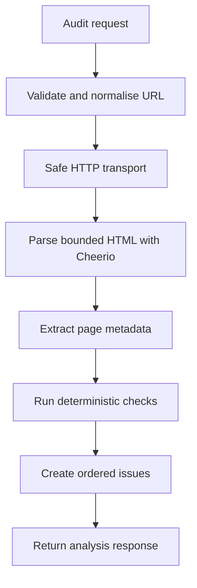
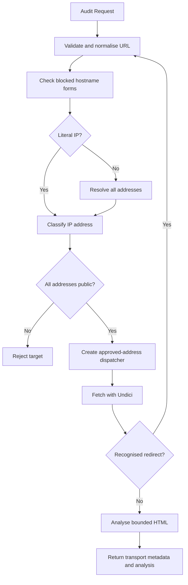

# PagePulse

PagePulse is a production-minded URL health and quality audit API being built for the Digital Heroes Software Development qualification task.

## Current Status

Phase 5 adds deterministic HTML analysis on top of the safe outbound HTTP transport layer. The API now validates and normalises audit URLs, performs destination-safety checks, fetches bounded HTML through the approved-address transport, parses the returned body with Cheerio, and returns transport metadata plus page signals, checks, and issues.

Final scoring, grades, caching, concurrency limits, rate limiting, CI, deployment, and the public demonstration interface are not implemented yet.

## Technology Stack

- Node.js 22 LTS target
- Express
- JavaScript ES modules
- Zod
- Pino and pino-http
- Undici
- Cheerio
- Vitest
- Supertest
- ESLint

## Prerequisites

- Node.js `>=22 <25`
- npm

## Local Setup

```bash
npm install
npm run check
npm start
```

The server listens on `PORT`, which defaults to `3000`.

For local development, copy the example environment file and run the watch-mode server:

```bash
cp .env.example .env
npm run dev
```

On Windows PowerShell:

```powershell
Copy-Item .env.example .env
npm run dev
```

`npm run dev` uses Node.js built-in `--env-file-if-exists=.env` support, so it loads `.env` when present and still starts when `.env` does not exist. `npm start` does not load `.env` automatically; production hosting platforms should provide environment variables directly.

## Environment Variables

Copy `.env.example` to `.env` for local development values. Do not commit real `.env` files.

| Name | Default | Allowed values | Purpose |
| --- | --- | --- | --- |
| `NODE_ENV` | `development` | `development`, `test`, `production` | Runtime mode |
| `PORT` | `3000` | Integer from `1` to `65535` | HTTP server port |
| `LOG_LEVEL` | `info` | `trace`, `debug`, `info`, `warn`, `error`, `fatal` | Structured logger level |
| `REQUEST_BODY_LIMIT` | `16kb` | Size string such as `16kb` | JSON request body limit |
| `AUDIT_TIMEOUT_MS` | `8000` | Integer from `500` to `30000` | Overall outbound audit transport timeout, including destination validation, DNS wait, redirects, and body streaming |
| `AUDIT_MAX_REDIRECTS` | `5` | Integer from `0` to `10` | Maximum manual redirects to follow |
| `AUDIT_MAX_RESPONSE_BYTES` | `1048576` | Integer from `1024` to `5242880` | Maximum upstream response body bytes |
| `AUDIT_USER_AGENT` | `PagePulseBot/1.0` | 1-120 chars after requiring at least one non-whitespace character, no CR/LF | Outbound audit User-Agent |

## Available Scripts

- `npm start`: start the production server
- `npm run dev`: start the server with Node watch mode
- `npm test`: run tests once
- `npm run test:watch`: run tests in watch mode
- `npm run coverage`: run tests with coverage
- `npm run lint`: run ESLint
- `npm run check`: run lint and tests

## Current Endpoints

### `GET /healthz`

Returns a standard success envelope.

```json
{
  "success": true,
  "requestId": "current-request-id",
  "data": {
    "status": "ok"
  }
}
```

Every response includes an `X-Request-ID` header.

### `POST /api/v1/audits`

Validates, normalises, safety-checks, fetches an audit target URL, and extracts deterministic HTML audit signals. In Phase 5, this endpoint returns transport metadata, page metadata, checks, and issues. It does not calculate a final score or grade.

Request body:

```json
{
  "url": "https://example.com"
}
```

The request body must be a JSON object with exactly one field: `url`.

Validation rules currently implemented:

- `url` is required.
- Unknown fields are rejected.
- `url` must be a string.
- Empty and whitespace-only strings are rejected.
- Raw URL values longer than 2048 characters are rejected.
- Malformed URLs are rejected.
- Only `http:` and `https:` URLs are accepted.
- URLs containing embedded usernames or passwords are rejected.

URL normalisation rules currently implemented:

- Surrounding whitespace is trimmed before parsing.
- Protocol and hostname are lowercased.
- Default port `80` is removed from HTTP URLs.
- Default port `443` is removed from HTTPS URLs.
- Non-default ports are preserved.
- Empty pathnames become `/`.
- Pathname case, query strings, and meaningful trailing slashes are preserved.
- URL fragments are removed because fragments are not sent in HTTP requests.

Important security boundary: Phase 4 performs destination checks before the initial connection and before every redirect. It also uses a per-request approved-address dispatcher so the connection path receives only the addresses approved for that specific URL step. This materially reduces DNS rebinding risk, but it is not a claim of complete SSRF prevention. See the security model below for current guarantees and limitations.

Successful analysis response:

```json
{
  "success": true,
  "requestId": "current-request-id",
  "data": {
    "requestedUrl": "https://example.com/",
    "finalUrl": "https://example.com/",
    "httpStatus": 200,
    "redirectCount": 0,
    "responseTimeMs": 123,
    "contentType": "text/html; charset=UTF-8",
    "responseSizeBytes": 1256,
    "auditedAt": "2026-07-27T00:00:00.000Z",
    "auditStatus": "analysis_complete",
    "page": {
      "title": "Example Domain",
      "metaDescription": null,
      "canonicalUrl": null,
      "language": "en",
      "headingCount": 1,
      "imageCount": 0,
      "linkCount": 1
    },
    "checks": {
      "https": {
        "status": "pass",
        "summary": "The final URL uses HTTPS.",
        "details": {
          "finalProtocol": "https:"
        }
      },
      "title": {
        "status": "pass",
        "summary": "The document title is present and within the preferred range.",
        "details": {
          "length": 14
        }
      },
      "metaDescription": {
        "status": "warning",
        "summary": "The page does not define a meta description.",
        "details": {
          "length": 0
        }
      },
      "canonical": {
        "status": "warning",
        "summary": "The page does not define a canonical URL.",
        "details": {
          "present": false,
          "count": 0
        }
      },
      "viewport": {
        "status": "pass",
        "summary": "The page defines a viewport meta tag.",
        "details": {
          "present": true
        }
      },
      "htmlLang": {
        "status": "pass",
        "summary": "The html element defines a plausible language.",
        "details": {
          "language": "en"
        }
      },
      "headings": {
        "status": "pass",
        "summary": "The page heading structure has one primary H1 and no detected structural warnings.",
        "details": {
          "total": 1,
          "h1Count": 1
        }
      },
      "images": {
        "status": "not_applicable",
        "summary": "The page does not include images.",
        "details": {
          "total": 0
        }
      },
      "links": {
        "status": "pass",
        "summary": "No empty or javascript link href values were detected.",
        "details": {
          "totalAnchors": 1,
          "anchorsWithHref": 1
        }
      },
      "securityHeaders": {
        "status": "warning",
        "summary": "2 of 6 recommended security headers are present or applicable.",
        "details": {
          "contentSecurityPolicy": {
            "status": "warning",
            "present": false
          }
        }
      }
    },
    "issues": []
  }
}
```

The PagePulse API returns HTTP `200` when transport and analysis complete, even if the upstream website returns a status such as `404` or `500`. The upstream status is reported as `httpStatus`, and non-2xx statuses add a deterministic `UPSTREAM_HTTP_STATUS` issue. The bounded HTML body is analysed internally and is not returned publicly.

Example Bash request:

```bash
curl -i -X POST http://localhost:3000/api/v1/audits \
  -H "Content-Type: application/json" \
  -H "X-Request-ID: local-example-1" \
  -d '{"url":"https://EXAMPLE.com:443/path?q=1#section"}'
```

Example Windows PowerShell request:

```powershell
curl.exe -i -X POST http://localhost:3000/api/v1/audits `
  -H "Content-Type: application/json" `
  -H "X-Request-ID: local-example-1" `
  -d '{\"url\":\"https://EXAMPLE.com:443/path?q=1#section\"}'
```

Example validation error:

```json
{
  "success": false,
  "requestId": "current-request-id",
  "error": {
    "code": "VALIDATION_ERROR",
    "message": "Request validation failed.",
    "details": [
      {
        "field": "url",
        "message": "URL is required."
      }
    ]
  }
}
```

## Error Catalogue

Current public error codes:

| Code | HTTP status | Meaning |
| --- | ---: | --- |
| `VALIDATION_ERROR` | 400 | Request body shape or field validation failed |
| `INVALID_JSON` | 400 | Request body contains malformed JSON |
| `INVALID_URL` | 400 | URL syntax is invalid |
| `UNSUPPORTED_PROTOCOL` | 400 | URL protocol is not `http:` or `https:` |
| `URL_CREDENTIALS_BLOCKED` | 400 | URL contains embedded username or password information |
| `BLOCKED_TARGET` | 400 | URL hostname or resolved destination is not allowed |
| `DNS_LOOKUP_FAILED` | 502 | Destination hostname could not be resolved |
| `UNSUPPORTED_MEDIA_TYPE` | 415 | Request body was supplied with a non-JSON content type |
| `UPSTREAM_TIMEOUT` | 504 | Destination did not respond within the allowed time |
| `UPSTREAM_CONNECTION_FAILED` | 502 | PagePulse could not connect to the destination |
| `UPSTREAM_TLS_ERROR` | 502 | PagePulse could not establish a secure connection to the destination |
| `TOO_MANY_REDIRECTS` | 502 | Destination exceeded the redirect limit |
| `INVALID_REDIRECT` | 502 | Destination returned an invalid redirect |
| `RESPONSE_TOO_LARGE` | 502 | Destination response exceeded the allowed size |
| `UPSTREAM_UNSUPPORTED_CONTENT` | 422 | Destination did not return supported HTML content |
| `UPSTREAM_REQUEST_FAILED` | 502 | Controlled fallback for other upstream transport failures |
| `HTML_ANALYSIS_FAILED` | 422 | Upstream HTML could not be parsed for analysis |
| `NOT_FOUND` | 404 | Route was not found |
| `INTERNAL_ERROR` | 500 | Unexpected application error |

## HTML Analysis

Phase 5 analyses only the bounded HTML body already returned by the safe HTTP client. It does not fetch links, images, scripts, stylesheets, favicons, canonical URLs, robots.txt, or any other page resource.



Architecture boundaries:

- The HTTP client fetches the bounded body and transport metadata only.
- The HTML analysis service receives `finalUrl`, retained response headers, `contentType`, and `body`, then coordinates analyzers.
- Analyzer modules perform deterministic parsing and checks without Express logic, network logic, global mutation, or resource fetching.
- The audit service coordinates transport plus analysis.
- The controller shapes the public response and does not extract HTML signals.

Cheerio parsing boundary:

- Scripts are not executed.
- Remote resources are not loaded.
- Malformed-but-parseable HTML is still analysed.
- UTF-8 decoding is supported; invalid UTF-8 uses replacement characters rather than crashing.
- Charset parameters are recorded internally for analysis context, but full non-UTF-8 transcoding is limited in this phase because no dedicated encoding dependency was added.
- Public text limits are measured in Unicode code points after whitespace normalisation. Truncation does not split surrogate pairs, and malformed lone surrogates are replaced before output.
- Raw HTML, script contents, unbounded page text, raw upstream headers, and cookies are not exposed publicly.
- Unexpected analyser bugs return `INTERNAL_ERROR` through the central error middleware without exposing raw HTML, parser messages, analyser messages, or stack traces.

Page metadata contract:

```json
{
  "title": "Example Domain",
  "metaDescription": null,
  "canonicalUrl": "https://example.com/",
  "language": "en",
  "headingCount": 1,
  "imageCount": 0,
  "linkCount": 1
}
```

Check result contract:

```json
{
  "status": "pass",
  "summary": "Human-readable result.",
  "details": {}
}
```

Statuses are stable: `pass`, `warning`, `fail`, and `not_applicable`. Checks are returned in this order: `https`, `title`, `metaDescription`, `canonical`, `viewport`, `htmlLang`, `headings`, `images`, `links`, `securityHeaders`.

Issue contract:

```json
{
  "code": "MISSING_TITLE",
  "severity": "error",
  "category": "seo",
  "message": "The page does not define a document title.",
  "suggestion": "Add a concise and descriptive <title> element."
}
```

Warnings and failures create one deterministic issue per condition. Passing checks do not create issues. Issue codes are unique and ordered by upstream status first, then the check order above.

Implemented check catalogue:

- `https`: warns when the final URL is HTTP. This does not judge TLS strength or certificate quality.
- `title`: missing/empty fails; 1-9 chars warns; 10-60 passes; over 60 warns. Exposed title text is whitespace-normalised and bounded.
- `metaDescription`: missing/empty warns; 1-49 warns; 50-160 passes; over 160 warns. Open Graph descriptions are not substitutes in this phase.
- `canonical`: missing, empty, malformed, unsupported protocol, embedded credentials, overlong public URL exposure, or multiple canonical tags warn. Relative canonicals resolve against the final URL but are never fetched. Canonical URLs longer than the public 500-code-point bound are validated but returned as `null` instead of exposing a truncated URL.
- `viewport`: missing or empty viewport meta warns; meaningful content passes.
- `htmlLang`: missing, empty, or clearly malformed `html[lang]` warns. Conservative tags such as `en`, `en-US`, `hi-IN`, `zh-Hant`, and `pt-BR` pass.
- `headings`: missing non-empty H1, multiple non-empty H1s, empty headings, and skipped heading levels warn. Full heading text is not exposed.
- `images`: no images returns `not_applicable`; missing `alt` warns; empty `alt=""` is accepted as potentially decorative.
- `links`: empty/whitespace href and `javascript:` href warn. Missing href, fragments, `mailto:`, `tel:`, HTTP/HTTPS links, and unsupported protocols are counted but not fetched.
- `securityHeaders`: checks the retained safe header subset for CSP, HSTS, X-Content-Type-Options, X-Frame-Options, Referrer-Policy, and Permissions-Policy. Header checks are intentionally basic and do not claim semantic security merely because a header is present.

Issue-code catalogue:

| Code | Severity | Category |
| --- | --- | --- |
| `UPSTREAM_HTTP_STATUS` | warning | content |
| `INSECURE_HTTP` | warning | security |
| `MISSING_TITLE` | error | seo |
| `TITLE_TOO_SHORT` | warning | seo |
| `TITLE_TOO_LONG` | warning | seo |
| `MISSING_META_DESCRIPTION` | warning | seo |
| `META_DESCRIPTION_TOO_SHORT` | warning | seo |
| `META_DESCRIPTION_TOO_LONG` | warning | seo |
| `MISSING_CANONICAL` | warning | seo |
| `EMPTY_CANONICAL` | warning | seo |
| `INVALID_CANONICAL` | warning | seo |
| `MULTIPLE_CANONICAL_TAGS` | warning | seo |
| `CANONICAL_URL_TOO_LONG` | warning | seo |
| `MISSING_VIEWPORT` | warning | accessibility |
| `MISSING_HTML_LANG` | warning | accessibility |
| `INVALID_HTML_LANG` | warning | accessibility |
| `MISSING_H1` | warning | content |
| `MULTIPLE_H1` | warning | content |
| `EMPTY_HEADING` | warning | content |
| `SKIPPED_HEADING_LEVEL` | warning | content |
| `IMAGE_MISSING_ALT` | warning | accessibility |
| `EMPTY_LINK_HREF` | warning | content |
| `JAVASCRIPT_LINK` | warning | content |
| `MISSING_CONTENT_SECURITY_POLICY` | warning | security |
| `MISSING_STRICT_TRANSPORT_SECURITY` | warning | security |
| `INVALID_X_CONTENT_TYPE_OPTIONS` | warning | security |
| `MISSING_X_FRAME_OPTIONS` | warning | security |
| `MISSING_REFERRER_POLICY` | warning | security |
| `MISSING_PERMISSIONS_POLICY` | warning | security |

No final score, grade, weighted totals, or separate recommendation list is returned in Phase 5. These deterministic checks may feed a later scoring policy.

## Destination Safety And SSRF Model

PagePulse performs destination validation before outbound transport and again before every redirect. The goal is to reduce server-side request forgery risk by failing closed unless the audit target is clearly a public destination.



Current destination-safety behaviour:

- Blocks explicit hostname forms such as `localhost`, `localhost.`, `*.localhost`, `ip6-localhost`, `ip6-loopback`, `broadcasthost`, and `localhost.localdomain`.
- Detects literal IPv4 and bracketed IPv6 URL hostnames and classifies them without DNS lookup.
- Uses Node's promise-based `dns.lookup(hostname, { all: true, verbatim: true })` for domain names so validation follows the operating-system resolver path used by normal connections.
- Observes the overall audit timeout while waiting for DNS. Node does not provide true cancellation for every in-flight `dns.lookup` operation, so PagePulse races lookup completion against the audit `AbortSignal` and rejects promptly while ignoring late lookup completion.
- Rejects DNS failures and empty DNS results.
- Rejects mixed DNS answers if any returned address is private, loopback, link-local, multicast, documentation, benchmarking, reserved, unspecified, or otherwise not confidently public.
- Accepts DNS answers only when every address parses correctly and every resolver `family` value matches the actual address family.
- Reduces IPv4-mapped IPv6 addresses to their mapped IPv4 address and applies the IPv4 rules.
- Rejects uncertain or malformed resolver results instead of attempting to continue.
- Supplies only approved addresses to the per-request Undici dispatcher lookup boundary.
- Preserves the original URL hostname for HTTP host handling and TLS server-name verification.
- Includes a deterministic local-socket test proving the production approved-address Undici dispatcher can connect through a fake hostname mapped by the approved lookup while preserving the original `Host` header. That test exercises transport mechanics only; destination policy still correctly blocks loopback audit targets.

Safe HTTP transport behaviour:

- Uses outbound `GET` only.
- Sends only `Accept`, configured `User-Agent`, and `Accept-Encoding: identity`.
- Does not forward inbound headers, cookies, authorization, proxy authorization, or user-provided headers.
- Handles redirects manually for `301`, `302`, `303`, `307`, and `308`.
- Revalidates every redirect target before following it.
- Rejects redirects without `Location`, malformed locations, unsupported protocols, embedded credentials, blocked targets, and redirect chains over the configured limit.
- Enforces a single overall timeout for the transport attempt.
- Applies that timeout across initial destination validation, DNS wait, dispatcher creation boundaries, the outbound request, redirect validation, and upstream body streaming.
- Rejects responses over `AUDIT_MAX_RESPONSE_BYTES`, even when `Content-Length` is missing or wrong.
- Accepts `text/html` and `application/xhtml+xml`, including charset parameters.
- Rejects missing, malformed, or non-HTML upstream content types.

Blocked target categories include:

- localhost-style names
- loopback addresses
- private IPv4 ranges
- unique-local IPv6 ranges
- link-local addresses
- carrier-grade NAT/shared address space
- documentation and benchmarking ranges
- multicast and reserved ranges
- unspecified and broadcast addresses
- IPv4-mapped IPv6 addresses that map to blocked IPv4 destinations

Example blocked-target response:

```json
{
  "success": false,
  "requestId": "current-request-id",
  "error": {
    "code": "BLOCKED_TARGET",
    "message": "The requested URL resolves to a destination that is not allowed.",
    "details": [
      {
        "field": "url",
        "reason": "blocked_destination",
        "hostname": "localhost"
      }
    ]
  }
}
```

Example DNS failure response:

```json
{
  "success": false,
  "requestId": "current-request-id",
  "error": {
    "code": "DNS_LOOKUP_FAILED",
    "message": "The destination hostname could not be resolved.",
    "details": [
      {
        "field": "url",
        "hostname": "missing.example"
      }
    ]
  }
}
```

Current security limitations:

- PagePulse now performs outbound HTTP transport and deterministic HTML analysis, but it still does not produce audit scores.
- DNS rebinding risk is reduced by per-step approved-address dispatching, but not eliminated by application-level checks alone.
- Real certificate and SNI behaviour relies on Undici's TLS stack and preserving the original hostname as `servername`; full production certificate-path validation may still require deployment-level validation against the eventual hosting environment.
- Deployment proxies, custom infrastructure, or future distributed architecture may require network-level egress rules.
- Cloud metadata hostnames, unusual resolver behaviour, split-horizon DNS, and deployment-network differences may require platform-specific hardening.
- URL parser canonicalisation can transform unusual numeric host forms before destination validation; uncertain parsed IP forms are rejected where they reach the IP classifier.

Security assumption: an audit target is eligible for future fetching only if every validated address is a clearly public unicast destination at the time of validation. Any uncertainty rejects the request.

## Public Page Credit

The later public demonstration page must include this visible linked credit:

Built for Digital Heroes Training Task

Link target: `https://digitalheroesco.com`

## License

MIT
