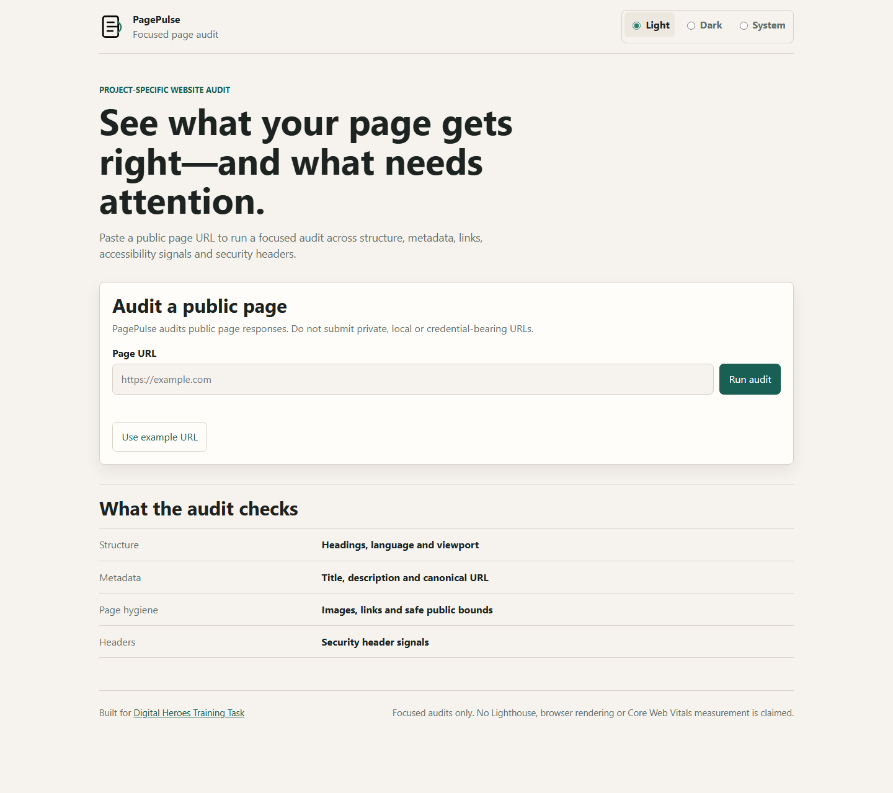
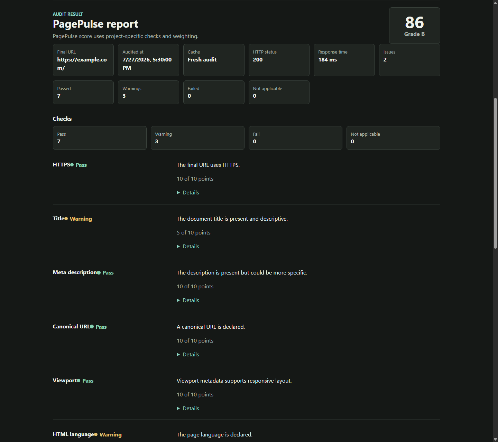
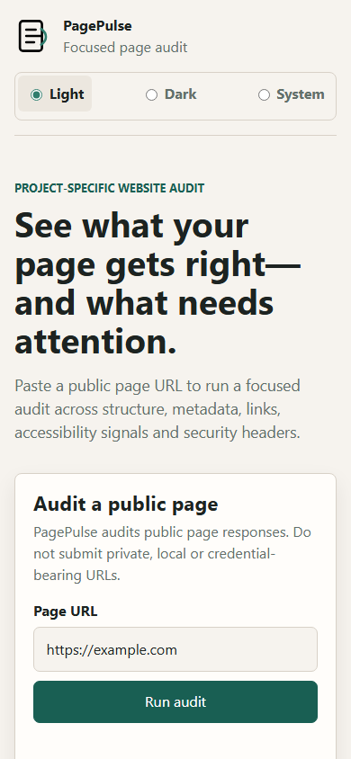
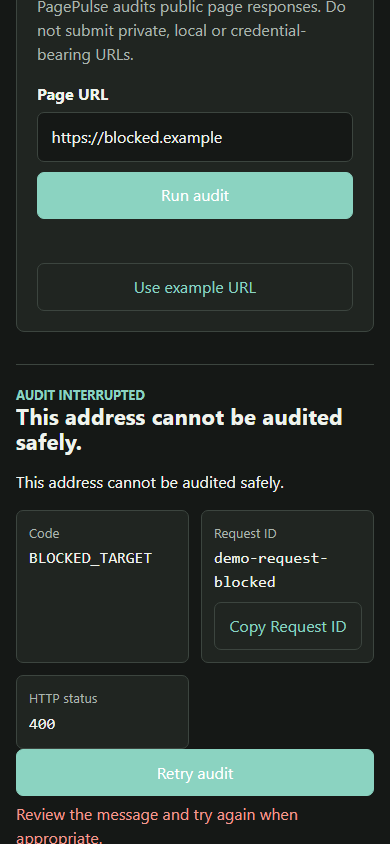
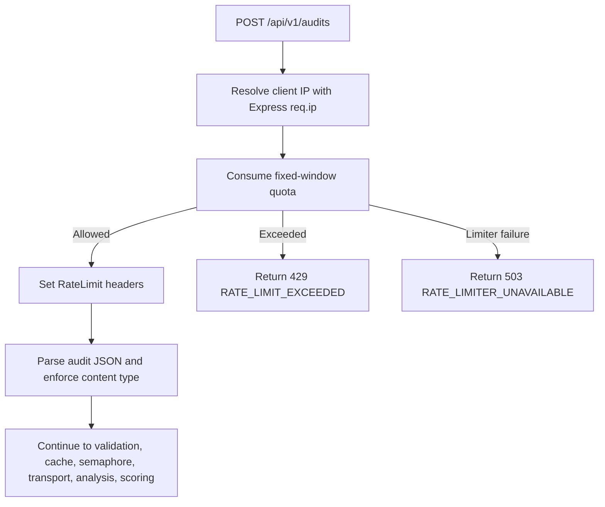
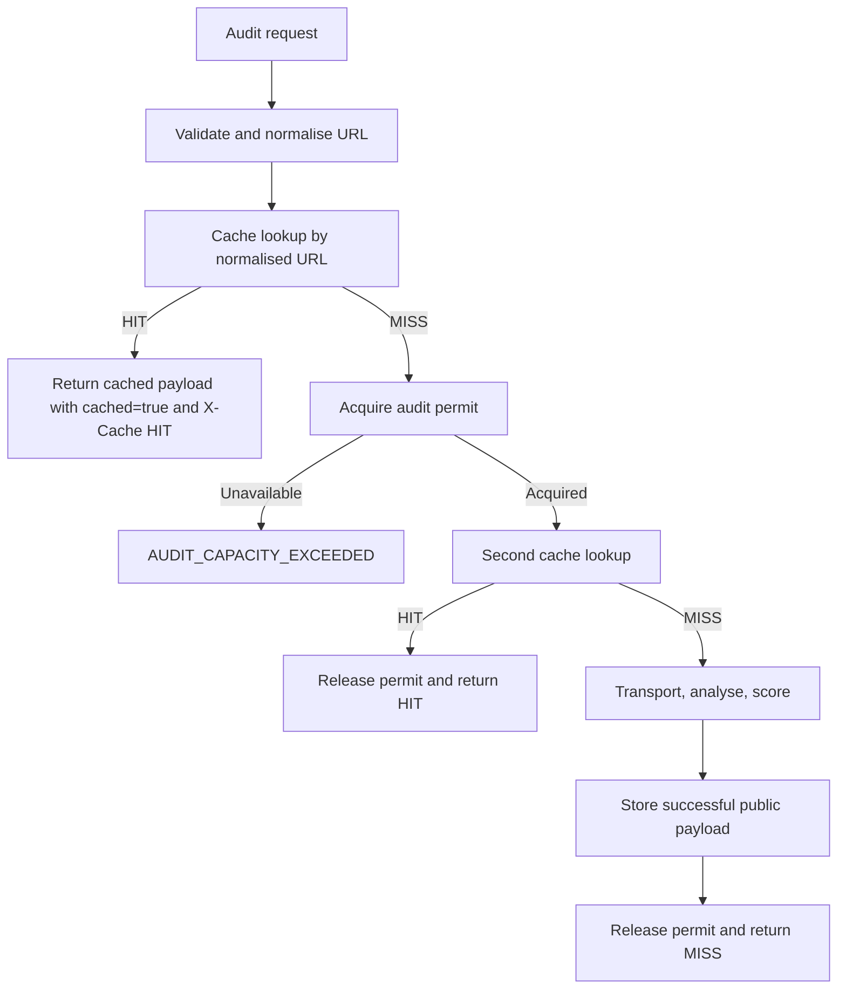
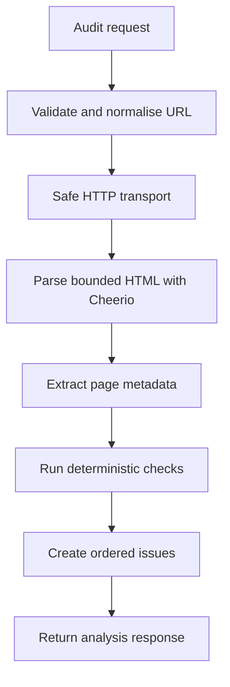
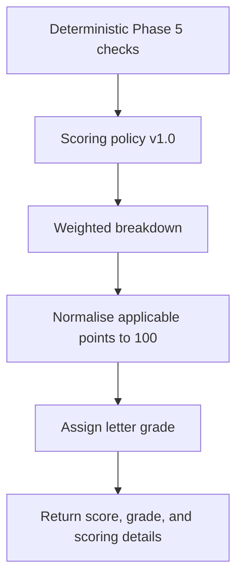
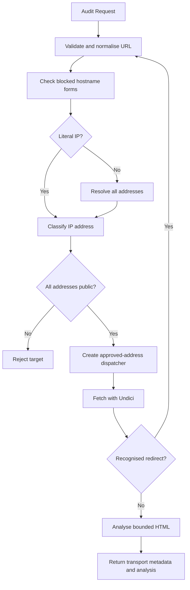

# PagePulse

PagePulse is a production-minded URL health and quality audit API being built for the Digital Heroes Software Development qualification task.

## Current Status

Backend phases 1 through 8 are implemented: configurable per-client fixed-window rate limiting, bounded in-memory TTL caching, per-process audit concurrency control, deterministic scoring, safe outbound HTTP transport, HTML analysis, destination safety, validation, structured logging, and the Express API foundation. Phase 9 adds local GitHub Actions CI configuration and repository quality gates. Phase 9B adds architecture documentation and reusable Mermaid diagram sources. Phase 10 adds a lightweight public demo UI served by the existing Express application. Phase 11A prepares Northflank deployment documentation and readiness checks.

The CI workflow is configured and will run on pushes and pull requests after this branch is merged. The public demonstration UI is implemented; deployment is prepared but not live.

## Technology Stack

- Node.js 22 LTS target
- Express
- JavaScript ES modules
- Zod
- Pino and pino-http
- Undici
- Cheerio
- Vitest
- Supertest
- ESLint

## Prerequisites

- Node.js `>=22 <25`
- npm

## Local Setup

```bash
npm ci
npm run check
npm start
```

The server listens on `PORT`, which defaults to `3000`.

For local development, copy the example environment file and run the watch-mode server:

```bash
cp .env.example .env
npm run dev
```

On Windows PowerShell:

```powershell
Copy-Item .env.example .env
npm run dev
```

`npm run dev` uses Node.js built-in `--env-file-if-exists=.env` support, so it loads `.env` when present and still starts when `.env` does not exist. `npm start` does not load `.env` automatically; production hosting platforms should provide environment variables directly.

## Environment Variables

Copy `.env.example` to `.env` for local development values. Do not commit real `.env` files.

| Name | Default | Allowed values | Purpose |
| --- | --- | --- | --- |
| `NODE_ENV` | `development` | `development`, `test`, `production` | Runtime mode |
| `PORT` | `3000` | Integer from `1` to `65535` | HTTP server port |
| `LOG_LEVEL` | `info` | `trace`, `debug`, `info`, `warn`, `error`, `fatal` | Structured logger level |
| `REQUEST_BODY_LIMIT` | `16kb` | Size string such as `16kb` | JSON request body limit |
| `AUDIT_TIMEOUT_MS` | `8000` | Integer from `500` to `30000` | Overall outbound audit transport timeout, including destination validation, DNS wait, redirects, and body streaming |
| `AUDIT_MAX_REDIRECTS` | `5` | Integer from `0` to `10` | Maximum manual redirects to follow |
| `AUDIT_MAX_RESPONSE_BYTES` | `1048576` | Integer from `1024` to `5242880` | Maximum upstream response body bytes |
| `AUDIT_USER_AGENT` | `PagePulseBot/1.0` | 1-120 chars after requiring at least one non-whitespace character, no CR/LF | Outbound audit User-Agent |
| `AUDIT_CACHE_ENABLED` | `true` | `true`, `false`, `1`, `0` | Enables the per-process in-memory audit cache |
| `AUDIT_CACHE_TTL_MS` | `300000` | Integer from `1000` to `3600000` | Cache entry lifetime in milliseconds |
| `AUDIT_CACHE_MAX_ENTRIES` | `500` | Integer from `1` to `5000` | Maximum cached audit payload count |
| `AUDIT_MAX_CONCURRENT` | `5` | Integer from `1` to `50` | Maximum active cache-miss audits |
| `AUDIT_MAX_QUEUE_SIZE` | `50` | Integer from `0` to `500` | Maximum FIFO queue depth for waiting audits |
| `AUDIT_QUEUE_TIMEOUT_MS` | `2000` | Integer from `100` to `30000` | Maximum time a request may wait for an audit permit |
| `AUDIT_RATE_LIMIT_ENABLED` | `true` | `true`, `false`, `1`, `0` | Enables per-client audit endpoint rate limiting |
| `AUDIT_RATE_LIMIT_WINDOW_MS` | `60000` | Integer from `1000` to `3600000` | Fixed rate-limit window length in milliseconds |
| `AUDIT_RATE_LIMIT_MAX_REQUESTS` | `30` | Integer from `1` to `10000` | Maximum audit attempts per client per window |
| `AUDIT_RATE_LIMIT_MAX_CLIENTS` | `10000` | Integer from `1` to `100000` | Maximum in-memory client buckets |
| `TRUST_PROXY` | `false` | `false`, `true`, or integer from `0` to `10` | Express trust-proxy setting for client IP resolution |

## Deployment Status

- Provider selected: Northflank.
- Status: Prepared, not live.
- Live URL: pending Northflank deployment.
- Architecture: one Buildpack service serving same-origin UI and API on runtime `PORT=8080`.
- Storage: no database, volume, or persistent storage.
- Production verification: pending generated HTTPS URL, health checks, proxy/IP behaviour, logs, and Lighthouse rerun.

Deployment readiness documentation lives in [docs/deployment/README.md](docs/deployment/README.md). The prepared architecture is documented in [docs/architecture/future-deployment-architecture.md](docs/architecture/future-deployment-architecture.md).

## Available Scripts

- `npm start`: start the production server
- `npm run dev`: start the server with Node watch mode
- `npm test`: run tests once
- `npm run test:watch`: run tests in watch mode
- `npm run coverage`: run tests with coverage
- `npm run lint`: run ESLint
- `npm run check`: run lint and tests
- `npm run check:hygiene`: reject commonly sensitive or generated tracked files
- `npm run check:docs`: verify required architecture, deployment, performance, screenshot, and diagram documentation structure
- `npm run ci`: run the local CI-equivalent lint, coverage, documentation, and hygiene checks

## Public Demo UI

Run the app locally and open [http://localhost:3000/](http://localhost:3000/) to use the PagePulse demo interface.

The UI is built with plain HTML, CSS and browser JavaScript. It provides a public URL audit form, idle/loading/success/error states, score and grade display, page metadata, stable check rows, issue details, technical metadata, copy actions, and clear handling for cache hits, rate limits, capacity errors, transport failures, and unexpected API responses. Browser retry countdowns use `Retry-After` seconds and are capped at one hour.

Theme modes are Light, Dark and System. Explicit choices are stored under `pagepulse.theme`; the UI stores only the most recently submitted URL under `pagepulse.lastUrl` for convenience.

Accessibility features include semantic landmarks, a skip link, visible labels, keyboard-accessible controls, focus states, `aria-live` status messaging, `aria-busy` during audits, non-colour-only statuses, responsive wrapping, and reduced-motion support.

The page is LCP-conscious by construction: the main heading and form are in initial HTML, JavaScript is module-loaded, there are no remote fonts, no external scripts or stylesheets, no frontend framework, no chart library, and no raster runtime assets. Local Lighthouse lab measurement is documented below; production measurement is still pending until deployment exists.

The footer visibly includes the required `Built for Digital Heroes Training Task` attribution linking to `https://digitalheroesco.com`.

## Interface Screenshots









## Performance Measurement

Local Lighthouse mobile measurements for the initial public UI are recorded in [docs/performance/lighthouse-report.md](docs/performance/lighthouse-report.md). The median of three local runs measured Performance 100, Accessibility 100, Best Practices 96, SEO 100, LCP 1.160 seconds, and CLS 0. These are lab measurements only, not production field data.

## Architecture Documentation

Detailed architecture notes live in [docs/architecture/README.md](docs/architecture/README.md), with reusable Mermaid sources in [docs/diagrams/README.md](docs/diagrams/README.md).

Key documents:

- [System overview](docs/architecture/system-overview.md)
- [Request lifecycle](docs/architecture/request-lifecycle.md)
- [Security architecture](docs/architecture/security-architecture.md)
- [Analysis and scoring](docs/architecture/analysis-and-scoring.md)
- [Caching and concurrency](docs/architecture/caching-and-concurrency.md)
- [Rate limiting](docs/architecture/rate-limiting.md)
- [CI and quality gates](docs/architecture/ci-and-quality-gates.md)
- [Architecture decisions](docs/architecture/architecture-decisions.md)

Frontend architecture is implemented for the current plain HTML, CSS and JavaScript UI. Deployment architecture is prepared for Northflank but is not live.

## Project Structure

```text
.
|-- .github/
|   |-- workflows/
|   |-- ISSUE_TEMPLATE/
|   `-- dependabot.yml
|-- docs/
|   |-- architecture/
|   `-- diagrams/
|-- scripts/
|-- src/
|-- tests/
|-- package.json
|-- package-lock.json
`-- README.md
```

## Continuous Integration

Phase 9 adds `.github/workflows/ci.yml`, a GitHub Actions workflow named `CI`. It is configured for pull requests targeting `main`, pushes to `main`, and manual `workflow_dispatch` runs. It does not deploy PagePulse.

The workflow uses:

- `ubuntu-latest`
- Node.js `22`
- `actions/checkout@v4` with `persist-credentials: false`
- `actions/setup-node@v4` with npm caching keyed by `package-lock.json`
- minimum repository permissions: `contents: read`
- concurrency cancellation for outdated runs on the same ref

CI quality gates:

- `npm ci` for clean lockfile-based installation
- `npm run lint`
- `npm run coverage`
- `npm run check:docs`
- `npm run check:hygiene`
- `npm ls --depth=0`
- `npm audit --audit-level=high`
- event-aware committed-diff whitespace validation for pull requests, pushes, and manual runs
- `git diff --check` after commands complete, to detect generated working-tree whitespace errors
- `git diff --exit-code -- package.json package-lock.json`
- `git status --short` after verification

Coverage is enforced by Vitest across `src/**/*.js` with global minimums of statements 90%, branches 85%, functions 90%, and lines 90%. Coverage reporters are `text`, `json-summary`, and `lcov`; generated `coverage/` output is ignored and should not be committed.

The dependency audit policy blocks high and critical vulnerability findings. Lower-severity findings should still be reviewed, but the workflow threshold is intentionally set to `high` to avoid noisy failures during this phase. CI does not run `npm audit fix` or modify dependencies.

The repository hygiene check uses `git ls-files` to reject commonly sensitive or generated tracked paths such as `.env`, `.env.local`, `.env.production`, `.env.development`, `node_modules/`, `coverage/`, `*.log`, `*.pem`, `*.key`, `id_rsa`, and `id_ed25519`. Matching is case-insensitive and `.env.example` is allowed. This is a lightweight path check, not a replacement for dedicated secret scanning.

The workflow has been verified locally, but the remote GitHub Actions run has not been proven until the first push or pull request executes it on GitHub.

Recommended branch protection for `main`:

- require a pull request before merging
- require the CI status check before merging
- require branches to be up to date before merging
- block force pushes
- block branch deletion
- require conversation resolution

Local CI-equivalent commands:

```powershell
npm ci
npm run lint
npm run coverage
npm run check:docs
npm run check:hygiene
npm ls --depth=0
npm audit --audit-level=high
git diff --check
```

## Current Endpoints

### `GET /healthz`

Returns a standard success envelope.

```json
{
  "success": true,
  "requestId": "current-request-id",
  "data": {
    "status": "ok"
  }
}
```

Every response includes an `X-Request-ID` header.

### `POST /api/v1/audits`

Rate-limits the audit attempt, validates, normalises, checks the audit cache, safety-checks and fetches a cache miss, extracts deterministic HTML audit signals, and calculates a transparent PagePulse score. In Phase 8, this endpoint returns the same JSON body as Phase 7 and exposes rate-limit state through headers only.

Request body:

```json
{
  "url": "https://example.com"
}
```

The request body must be a JSON object with exactly one field: `url`.

Validation rules currently implemented:

- `url` is required.
- Unknown fields are rejected.
- `url` must be a string.
- Empty and whitespace-only strings are rejected.
- Raw URL values longer than 2048 characters are rejected.
- Malformed URLs are rejected.
- Only `http:` and `https:` URLs are accepted.
- URLs containing embedded usernames or passwords are rejected.

URL normalisation rules currently implemented:

- Surrounding whitespace is trimmed before parsing.
- Protocol and hostname are lowercased.
- Default port `80` is removed from HTTP URLs.
- Default port `443` is removed from HTTPS URLs.
- Non-default ports are preserved.
- Empty pathnames become `/`.
- Pathname case, query strings, and meaningful trailing slashes are preserved.
- URL fragments are removed because fragments are not sent in HTTP requests.

Important security boundary: Phase 4 performs destination checks before the initial connection and before every redirect. It also uses a per-request approved-address dispatcher so the connection path receives only the addresses approved for that specific URL step. This materially reduces DNS rebinding risk, but it is not a claim of complete SSRF prevention. See the security model below for current guarantees and limitations.

Successful analysis response:

```json
{
  "success": true,
  "requestId": "current-request-id",
  "data": {
    "requestedUrl": "https://example.com/",
    "finalUrl": "https://example.com/",
    "httpStatus": 200,
    "redirectCount": 0,
    "responseTimeMs": 123,
    "contentType": "text/html; charset=UTF-8",
    "responseSizeBytes": 1256,
    "auditedAt": "2026-07-27T00:00:00.000Z",
    "auditStatus": "complete",
    "cached": false,
    "score": 86,
    "grade": "B",
    "scoring": {
      "scoringPolicyVersion": "1.0",
      "earnedPoints": 79,
      "possiblePoints": 92,
      "excludedPoints": 8,
      "breakdown": {
        "https": {
          "status": "pass",
          "weight": 10,
          "applicable": true,
          "earnedPoints": 10
        },
        "title": {
          "status": "pass",
          "weight": 12,
          "applicable": true,
          "earnedPoints": 12
        },
        "metaDescription": {
          "status": "warning",
          "weight": 10,
          "applicable": true,
          "earnedPoints": 5
        },
        "canonical": {
          "status": "warning",
          "weight": 8,
          "applicable": true,
          "earnedPoints": 4
        },
        "viewport": {
          "status": "pass",
          "weight": 8,
          "applicable": true,
          "earnedPoints": 8
        },
        "htmlLang": {
          "status": "pass",
          "weight": 8,
          "applicable": true,
          "earnedPoints": 8
        },
        "headings": {
          "status": "pass",
          "weight": 12,
          "applicable": true,
          "earnedPoints": 12
        },
        "images": {
          "status": "not_applicable",
          "weight": 8,
          "applicable": false,
          "earnedPoints": 0
        },
        "links": {
          "status": "pass",
          "weight": 8,
          "applicable": true,
          "earnedPoints": 8
        },
        "securityHeaders": {
          "status": "warning",
          "weight": 16,
          "applicable": true,
          "earnedPoints": 8
        }
      }
    },
    "page": {
      "title": "Example Domain",
      "metaDescription": null,
      "canonicalUrl": null,
      "language": "en",
      "headingCount": 1,
      "imageCount": 0,
      "linkCount": 1
    },
    "checks": {
      "https": {
        "status": "pass",
        "summary": "The final URL uses HTTPS.",
        "details": {
          "finalProtocol": "https:"
        }
      },
      "title": {
        "status": "pass",
        "summary": "The document title is present and within the preferred range.",
        "details": {
          "length": 14
        }
      },
      "metaDescription": {
        "status": "warning",
        "summary": "The page does not define a meta description.",
        "details": {
          "length": 0
        }
      },
      "canonical": {
        "status": "warning",
        "summary": "The page does not define a canonical URL.",
        "details": {
          "present": false,
          "count": 0
        }
      },
      "viewport": {
        "status": "pass",
        "summary": "The page defines a viewport meta tag.",
        "details": {
          "present": true
        }
      },
      "htmlLang": {
        "status": "pass",
        "summary": "The html element defines a plausible language.",
        "details": {
          "language": "en"
        }
      },
      "headings": {
        "status": "pass",
        "summary": "The page heading structure has one primary H1 and no detected structural warnings.",
        "details": {
          "total": 1,
          "h1Count": 1
        }
      },
      "images": {
        "status": "not_applicable",
        "summary": "The page does not include images.",
        "details": {
          "total": 0
        }
      },
      "links": {
        "status": "pass",
        "summary": "No empty or javascript link href values were detected.",
        "details": {
          "totalAnchors": 1,
          "anchorsWithHref": 1
        }
      },
      "securityHeaders": {
        "status": "warning",
        "summary": "2 of 6 recommended security headers are present or applicable.",
        "details": {
          "contentSecurityPolicy": {
            "status": "warning",
            "present": false
          }
        }
      }
    },
    "issues": []
  }
}
```

The PagePulse API returns HTTP `200` when transport and analysis complete, even if the upstream website returns a status such as `404` or `500`. The upstream status is reported as `httpStatus`, and non-2xx statuses add a deterministic `UPSTREAM_HTTP_STATUS` issue. The bounded HTML body is analysed internally and is not returned publicly.

Example Bash request:

```bash
curl -i -X POST http://localhost:3000/api/v1/audits \
  -H "Content-Type: application/json" \
  -H "X-Request-ID: local-example-1" \
  -d '{"url":"https://EXAMPLE.com:443/path?q=1#section"}'
```

Example Windows PowerShell request:

```powershell
curl.exe -i -X POST http://localhost:3000/api/v1/audits `
  -H "Content-Type: application/json" `
  -H "X-Request-ID: local-example-1" `
  -d '{\"url\":\"https://EXAMPLE.com:443/path?q=1#section\"}'
```

Example validation error:

```json
{
  "success": false,
  "requestId": "current-request-id",
  "error": {
    "code": "VALIDATION_ERROR",
    "message": "Request validation failed.",
    "details": [
      {
        "field": "url",
        "message": "URL is required."
      }
    ]
  }
}
```

## Error Catalogue

Current public error codes:

| Code | HTTP status | Meaning |
| --- | ---: | --- |
| `VALIDATION_ERROR` | 400 | Request body shape or field validation failed |
| `INVALID_JSON` | 400 | Request body contains malformed JSON |
| `INVALID_URL` | 400 | URL syntax is invalid |
| `UNSUPPORTED_PROTOCOL` | 400 | URL protocol is not `http:` or `https:` |
| `URL_CREDENTIALS_BLOCKED` | 400 | URL contains embedded username or password information |
| `BLOCKED_TARGET` | 400 | URL hostname or resolved destination is not allowed |
| `DNS_LOOKUP_FAILED` | 502 | Destination hostname could not be resolved |
| `UNSUPPORTED_MEDIA_TYPE` | 415 | Request body was supplied with a non-JSON content type |
| `UPSTREAM_TIMEOUT` | 504 | Destination did not respond within the allowed time |
| `UPSTREAM_CONNECTION_FAILED` | 502 | PagePulse could not connect to the destination |
| `UPSTREAM_TLS_ERROR` | 502 | PagePulse could not establish a secure connection to the destination |
| `TOO_MANY_REDIRECTS` | 502 | Destination exceeded the redirect limit |
| `INVALID_REDIRECT` | 502 | Destination returned an invalid redirect |
| `RESPONSE_TOO_LARGE` | 502 | Destination response exceeded the allowed size |
| `UPSTREAM_UNSUPPORTED_CONTENT` | 422 | Destination did not return supported HTML content |
| `UPSTREAM_REQUEST_FAILED` | 502 | Controlled fallback for other upstream transport failures |
| `HTML_ANALYSIS_FAILED` | 422 | Upstream HTML could not be parsed for analysis |
| `AUDIT_CAPACITY_EXCEEDED` | 503 | Active audit capacity is full, the FIFO queue is full, or a queued audit waited too long for a permit |
| `RATE_LIMIT_EXCEEDED` | 429 | Client exceeded the configured audit request limit for the current fixed window |
| `RATE_LIMITER_UNAVAILABLE` | 503 | Audit request limiting failed closed because the limiter could not make a safe decision |
| `NOT_FOUND` | 404 | Route was not found |
| `INTERNAL_ERROR` | 500 | Unexpected application error |

## Rate Limiting

Phase 8 applies a custom fixed-window rate limiter only to `POST /api/v1/audits`. Health, API-root, unknown-route, and future static-asset requests are not rate-limited. The limiter is in-memory and per-process; counters reset on process restart, horizontally scaled instances do not share counters, and distributed rate limiting would require shared infrastructure.



Client identity policy:

- PagePulse uses Express `req.ip` as the client source.
- `TRUST_PROXY=false` is the default; direct socket IP is authoritative and spoofed `X-Forwarded-For` values are ignored.
- `TRUST_PROXY=true` enables Express proxy trust, so forwarded client identity is respected according to Express behaviour.
- `TRUST_PROXY` may also be an integer hop count from `0` through `10`.
- Empty, whitespace-only, decimal, comma-separated, and arbitrary string `TRUST_PROXY` values are rejected during configuration loading.
- PagePulse does not manually parse arbitrary forwarded headers. Incorrect proxy trust configuration can allow spoofing or collapse clients into incorrect buckets.
- Client keys trim surrounding whitespace, lowercase text, preserve IPv6 consistently, and normalise IPv4-mapped IPv6 such as `::ffff:127.0.0.1` to `127.0.0.1`.
- Missing or empty client IPs use the shared fallback bucket `unknown-client`.
- Request IDs and requested audit URLs are never used as client keys.

Fixed-window algorithm:

- The first audit attempt for a client starts a fixed window.
- Requests up to `AUDIT_RATE_LIMIT_MAX_REQUESTS` are allowed.
- Request `maxRequests + 1` is rejected with `RATE_LIMIT_EXCEEDED`.
- `now < resetAt` remains in the same window; `now >= resetAt` starts a new window.
- Allowed and rejected requests do not extend the reset time; this is not a sliding-window, token-bucket, API-key, authentication, user-account, DDoS-prevention, or WAF system.
- Rejected requests keep the stored count capped at the configured maximum.

Bounded client storage:

- The limiter stores at most `AUDIT_RATE_LIMIT_MAX_CLIENTS` buckets.
- Expired buckets are removed lazily; no background cleanup timer is created.
- If storage is still full, the least-recently-seen client is evicted deterministically.
- Allowed and rejected requests update client recency.
- An evicted client can begin a fresh window if it returns. This is a deliberate bounded-memory tradeoff.
- Disabled rate limiting stores no buckets and emits no rate-limit headers.

Rate-limit headers:

| Header | Meaning |
| --- | --- |
| `RateLimit-Limit` | Configured maximum audit attempts per window |
| `RateLimit-Remaining` | Remaining attempts after the current request is consumed |
| `RateLimit-Reset` | Whole seconds until the current fixed window resets, rounded up |
| `Retry-After` | Present only on rejected 429 responses; whole seconds until retry, minimum `1` |

Worked example with `AUDIT_RATE_LIMIT_MAX_REQUESTS=3`:

```text
Request 1 -> 200, RateLimit-Limit: 3, RateLimit-Remaining: 2
Request 2 -> 200, RateLimit-Limit: 3, RateLimit-Remaining: 1
Request 3 -> 200, RateLimit-Limit: 3, RateLimit-Remaining: 0
Request 4 -> 429, RateLimit-Remaining: 0, Retry-After: positive integer
```

Rate-limit response:

```json
{
  "success": false,
  "requestId": "request-id",
  "error": {
    "code": "RATE_LIMIT_EXCEEDED",
    "message": "Too many audit requests. Please try again later.",
    "details": [
      {
        "retryAfterSeconds": 17
      }
    ]
  }
}
```

Limiter-unavailable response:

```json
{
  "success": false,
  "requestId": "request-id",
  "error": {
    "code": "RATE_LIMITER_UNAVAILABLE",
    "message": "Audit request limiting is temporarily unavailable.",
    "details": []
  }
}
```

Interaction with cache and concurrency:

- Rate limiting runs before audit JSON parsing, content-type checks, request validation, cache lookup, and semaphore acquisition.
- Malformed JSON, unsupported audit media types, ordinary validation failures, blocked targets, cache hits, cache misses, capacity failures, analyser errors, scorer errors, and successful audits all consume quota after a client identity is resolved.
- Cache hits count toward the client limit.
- Already over-limit requests are rejected before JSON parsing, content-type validation, cache lookup, semaphore acquisition, DNS, transport, analysis, or scoring. They do not read the audit cache, do not change cache recency, do not acquire semaphore permits, and do not enter the audit queue.
- Queue-full capacity failures and rate-limit failures remain distinct: capacity uses HTTP `503` with `AUDIT_CAPACITY_EXCEEDED`; rate limiting uses HTTP `429` with `RATE_LIMIT_EXCEEDED`.
- If an injected limiter throws or returns a malformed decision, PagePulse fails closed with `RATE_LIMITER_UNAVAILABLE`, omits misleading rate-limit headers, and performs no audit/cache/semaphore work. Injected decisions must be plain objects with only `allowed`, `limit`, `remaining`, `resetAt`, and `retryAfterSeconds`, and the numeric fields must be finite non-negative integers with internally consistent allowed/rejected values.

## Cache And Concurrency

Phase 7 introduced a custom per-process in-memory TTL cache and a custom per-process asynchronous semaphore. This is appropriate for the current single-instance API shape. The cache is cleared on restart, horizontally scaled instances do not share entries, and distributed deployment would require shared cache or coordinated capacity infrastructure.



Cache key rules:

- The key is the fully normalised requested audit URL.
- Hostname case, default ports, and fragments follow the URL normalisation rules above.
- Path and query string remain significant, so `/a`, `/b`, `?a=1`, and `?a=2` are distinct.
- Request ID, client IP, response headers, score alone, and raw request bodies are not cache keys.

Cache value rules:

- The cache stores only the completed public audit payload: transport metadata, `auditStatus`, score, grade, scoring breakdown, page, checks, and issues.
- The cache does not store request IDs, success envelopes, `cached`, `X-Cache`, raw HTML, raw upstream headers, approved IP addresses, dispatchers, streams, abort controllers, errors, loggers, or Express objects.
- Values are cloned on write and read with `structuredClone`, so mutating a returned response cannot mutate the stored entry.
- Cached values are validated before use. Malformed or stale injected cache entries are treated as misses, may be discarded, and do not produce a public cache error; PagePulse proceeds with a fresh audit when possible.

TTL and eviction:

- TTL starts when a successful audit payload is stored.
- Entries are valid before expiry and expired at or after the expiry timestamp.
- Cache hits do not extend TTL.
- Replacing an entry resets TTL.
- Expired entries are removed lazily; no background cleanup interval is created.
- Capacity is bounded by `AUDIT_CACHE_MAX_ENTRIES`.
- Eviction is deterministic LRU: valid hits and sets move an entry to most-recent position; when full, the least-recently-used entry is removed.
- Disabled cache always misses, stores nothing, and remains size zero.

Successful audit response cache state:

| Scenario | `cached` | Header |
| --- | --- | --- |
| Fresh audit | `false` | `X-Cache: MISS` |
| Cache hit | `true` | `X-Cache: HIT` |

Every request receives a fresh `requestId`, including cache hits. Cache hits preserve the original cached payload values such as `auditedAt`, `responseTimeMs`, `finalUrl`, score, checks, and issues; they do not pretend a new audit ran. Error responses omit `X-Cache`.

Repeated-request example:

```text
POST /api/v1/audits {"url":"https://EXAMPLE.com:443/#section"}
-> normalised key https://example.com/
-> X-Cache: MISS, cached: false, requestId: A

POST /api/v1/audits {"url":"https://example.com/"}
-> same normalised key
-> X-Cache: HIT, cached: true, requestId: B
-> auditedAt and responseTimeMs remain from the original audit
```

Caching eligibility:

- Successful completed HTML audits are cached after transport, analysis, and scoring complete.
- Validation errors, blocked targets, DNS failures, timeouts, connection failures, TLS failures, redirect failures, oversized responses, unsupported content, analyser errors, scorer errors, capacity errors, and internal errors are not cached.
- Completed upstream `404` or `500` HTML audits may be cached because PagePulse completed transport, analysis, and scoring; the upstream status remains visible as `httpStatus` and an issue.
- Unexpected cache read errors fail open as misses; unexpected cache write errors fail open and still return the fresh successful audit.

Concurrency control:

- Cache hits bypass the semaphore and do not consume audit permits.
- Cache misses acquire a permit before destination safety, DNS, transport, analysis, and scoring.
- At most `AUDIT_MAX_CONCURRENT` cache-miss audits hold permits at once.
- Additional cache misses wait in a per-process FIFO queue up to `AUDIT_MAX_QUEUE_SIZE`.
- Queue size `0` disables waiting; requests beyond active capacity fail immediately.
- Waiting requests fail with `AUDIT_CAPACITY_EXCEEDED` if they exceed `AUDIT_QUEUE_TIMEOUT_MS`.
- Queue timeout is separate from `AUDIT_TIMEOUT_MS`: a request may wait up to `AUDIT_QUEUE_TIMEOUT_MS`, then run transport under `AUDIT_TIMEOUT_MS`.
- Permit release runs in a `finally` path after success, transport failure, analysis failure, scorer failure, or cache-write failure.
- After a queued request acquires a permit, PagePulse checks the cache again before transport. If another request already populated the cache for the same normalised URL, the permit is released and the request returns `X-Cache: HIT`.
- Semaphore state is internal to the application instance and is not exposed through public API responses or capacity errors.

Capacity error response:

```json
{
  "success": false,
  "requestId": "current-request-id",
  "error": {
    "code": "AUDIT_CAPACITY_EXCEEDED",
    "message": "PagePulse is currently processing the maximum number of audits.",
    "details": [
      {
        "reason": "queue_full"
      }
    ]
  }
}
```

Stable capacity reasons are `capacity_reached`, `queue_full`, and `queue_timeout`. They do not expose active URLs, queued URLs, thread counts, other clients, internal promise state, or stack traces.

## HTML Analysis

Phase 5 analyses only the bounded HTML body already returned by the safe HTTP client. It does not fetch links, images, scripts, stylesheets, favicons, canonical URLs, robots.txt, or any other page resource.



Architecture boundaries:

- The HTTP client fetches the bounded body and transport metadata only.
- The HTML analysis service receives `finalUrl`, retained response headers, `contentType`, and `body`, then coordinates analyzers.
- Analyzer modules perform deterministic parsing and checks without Express logic, network logic, global mutation, or resource fetching.
- The audit service coordinates transport plus analysis.
- The controller shapes the public response and does not extract HTML signals.

Cheerio parsing boundary:

- Scripts are not executed.
- Remote resources are not loaded.
- Malformed-but-parseable HTML is still analysed.
- UTF-8 decoding is supported; invalid UTF-8 uses replacement characters rather than crashing.
- Charset parameters are recorded internally for analysis context, but full non-UTF-8 transcoding is limited in this phase because no dedicated encoding dependency was added.
- Public text limits are measured in Unicode code points after whitespace normalisation. Truncation does not split surrogate pairs, and malformed lone surrogates are replaced before output.
- Raw HTML, script contents, unbounded page text, raw upstream headers, and cookies are not exposed publicly.
- Unexpected analyser bugs return `INTERNAL_ERROR` through the central error middleware without exposing raw HTML, parser messages, analyser messages, or stack traces.

Page metadata contract:

```json
{
  "title": "Example Domain",
  "metaDescription": null,
  "canonicalUrl": "https://example.com/",
  "language": "en",
  "headingCount": 1,
  "imageCount": 0,
  "linkCount": 1
}
```

Check result contract:

```json
{
  "status": "pass",
  "summary": "Human-readable result.",
  "details": {}
}
```

Statuses are stable: `pass`, `warning`, `fail`, and `not_applicable`. Checks are returned in this order: `https`, `title`, `metaDescription`, `canonical`, `viewport`, `htmlLang`, `headings`, `images`, `links`, `securityHeaders`.

Issue contract:

```json
{
  "code": "MISSING_TITLE",
  "severity": "error",
  "category": "seo",
  "message": "The page does not define a document title.",
  "suggestion": "Add a concise and descriptive <title> element."
}
```

Warnings and failures create one deterministic issue per condition. Passing checks do not create issues. Issue codes are unique and ordered by upstream status first, then the check order above.

Implemented check catalogue:

- `https`: warns when the final URL is HTTP. This does not judge TLS strength or certificate quality.
- `title`: missing/empty fails; 1-9 chars warns; 10-60 passes; over 60 warns. Exposed title text is whitespace-normalised and bounded.
- `metaDescription`: missing/empty warns; 1-49 warns; 50-160 passes; over 160 warns. Open Graph descriptions are not substitutes in this phase.
- `canonical`: missing, empty, malformed, unsupported protocol, embedded credentials, overlong public URL exposure, or multiple canonical tags warn. Relative canonicals resolve against the final URL but are never fetched. Canonical URLs longer than the public 500-code-point bound are validated but returned as `null` instead of exposing a truncated URL.
- `viewport`: missing or empty viewport meta warns; meaningful content passes.
- `htmlLang`: missing, empty, or clearly malformed `html[lang]` warns. Conservative tags such as `en`, `en-US`, `hi-IN`, `zh-Hant`, and `pt-BR` pass.
- `headings`: missing non-empty H1, multiple non-empty H1s, empty headings, and skipped heading levels warn. Full heading text is not exposed.
- `images`: no images returns `not_applicable`; missing `alt` warns; empty `alt=""` is accepted as potentially decorative.
- `links`: empty/whitespace href and `javascript:` href warn. Missing href, fragments, `mailto:`, `tel:`, HTTP/HTTPS links, and unsupported protocols are counted but not fetched.
- `securityHeaders`: checks the retained safe header subset for CSP, HSTS, X-Content-Type-Options, X-Frame-Options, Referrer-Policy, and Permissions-Policy. Header checks are intentionally basic and do not claim semantic security merely because a header is present.

Issue-code catalogue:

| Code | Severity | Category |
| --- | --- | --- |
| `UPSTREAM_HTTP_STATUS` | warning | content |
| `INSECURE_HTTP` | warning | security |
| `MISSING_TITLE` | error | seo |
| `TITLE_TOO_SHORT` | warning | seo |
| `TITLE_TOO_LONG` | warning | seo |
| `MISSING_META_DESCRIPTION` | warning | seo |
| `META_DESCRIPTION_TOO_SHORT` | warning | seo |
| `META_DESCRIPTION_TOO_LONG` | warning | seo |
| `MISSING_CANONICAL` | warning | seo |
| `EMPTY_CANONICAL` | warning | seo |
| `INVALID_CANONICAL` | warning | seo |
| `MULTIPLE_CANONICAL_TAGS` | warning | seo |
| `CANONICAL_URL_TOO_LONG` | warning | seo |
| `MISSING_VIEWPORT` | warning | accessibility |
| `MISSING_HTML_LANG` | warning | accessibility |
| `INVALID_HTML_LANG` | warning | accessibility |
| `MISSING_H1` | warning | content |
| `MULTIPLE_H1` | warning | content |
| `EMPTY_HEADING` | warning | content |
| `SKIPPED_HEADING_LEVEL` | warning | content |
| `IMAGE_MISSING_ALT` | warning | accessibility |
| `EMPTY_LINK_HREF` | warning | content |
| `JAVASCRIPT_LINK` | warning | content |
| `MISSING_CONTENT_SECURITY_POLICY` | warning | security |
| `MISSING_STRICT_TRANSPORT_SECURITY` | warning | security |
| `INVALID_X_CONTENT_TYPE_OPTIONS` | warning | security |
| `MISSING_X_FRAME_OPTIONS` | warning | security |
| `MISSING_REFERRER_POLICY` | warning | security |
| `MISSING_PERMISSIONS_POLICY` | warning | security |

Phase 5 extraction rules remain unchanged in Phase 7. No separate recommendation list is returned; issue suggestions remain inside the `issues` array.

## Scoring

PagePulse score is a transparent project-specific audit score. It is not a Google, Lighthouse, Core Web Vitals, industry-standard SEO, or universal website-quality score.



Scoring architecture:

- `src/scoring/scoring-policy.js` stores the immutable policy version, check order, weights, status multipliers, and grade boundaries.
- `src/scoring/audit-scorer.js` validates the generated check structure and calculates scoring output.
- The audit service coordinates transport, HTML analysis, and scoring.
- The controller exposes the calculated score and does not contain scoring weights or calculations.

Scoring policy version: `1.0`. Future scoring-policy changes should increment this version so scores remain comparable.

The scorer expects exactly the ten approved own check keys. Unknown own keys, including non-enumerable string keys and symbol keys, fail internally instead of being silently ignored. Inherited properties do not count as checks. The exported grade helper accepts only integer scores from `0` through `100`; invalid direct inputs fail through the internal error path.

Weight table:

| Check | Weight |
| --- | ---: |
| `https` | 10 |
| `title` | 12 |
| `metaDescription` | 10 |
| `canonical` | 8 |
| `viewport` | 8 |
| `htmlLang` | 8 |
| `headings` | 12 |
| `images` | 8 |
| `links` | 8 |
| `securityHeaders` | 16 |
| Total | 100 |

Status multipliers:

| Status | Multiplier |
| --- | ---: |
| `pass` | 1 |
| `warning` | 0.5 |
| `fail` | 0 |
| `not_applicable` | excluded |

Normalisation formula:

```text
rawRatio = earnedPoints / possiblePoints
score = round(rawRatio * 100)
```

`not_applicable` checks are excluded from both earned and possible points. Their weight is reported as `excludedPoints`; `possiblePoints + excludedPoints` remains `100`. If the scorer ever receives all checks as `not_applicable`, it fails internally instead of returning a misleading score.

Grade table:

| Score | Grade |
| --- | --- |
| 90-100 | A |
| 80-89 | B |
| 70-79 | C |
| 60-69 | D |
| 0-59 | F |

Breakdown entry contract:

```json
{
  "status": "pass",
  "weight": 10,
  "applicable": true,
  "earnedPoints": 10
}
```

The scoring breakdown always contains all ten checks in the same deterministic order as `checks`.

Important scoring rules:

- Score is calculated only from the ten top-level check statuses.
- Issue order, duplicate issues, issue text, issue suggestions, check summaries, check details, and page metadata do not directly affect score.
- `UPSTREAM_HTTP_STATUS` does not directly reduce score because it is an issue, not a top-level scoring check.
- `securityHeaders` is scored through its grouped top-level status. Individual security-header subchecks are not separately weighted in Phase 6.
- The scoring policy is immutable at runtime and does not read environment variables, current time, request IDs, network state, or random values.

Worked examples:

| Scenario | Raw points | Possible points | Excluded points | Score | Grade |
| --- | ---: | ---: | ---: | ---: | --- |
| All applicable checks pass | 100 | 100 | 0 | 100 | A |
| Images not applicable, everything else passes | 92 | 92 | 8 | 100 | A |
| Title fails, everything else passes | 88 | 100 | 0 | 88 | B |
| Title, description, and canonical warn | 85 | 100 | 0 | 85 | B |
| Score boundary | 90 | 100 | 0 | 90 | A |
| Score boundary | 89 | 100 | 0 | 89 | B |
| Score boundary | 79 | 100 | 0 | 79 | C |
| Score boundary | 69 | 100 | 0 | 69 | D |
| Score boundary | 59 | 100 | 0 | 59 | F |

## Destination Safety And SSRF Model

PagePulse performs destination validation before outbound transport and again before every redirect. The goal is to reduce server-side request forgery risk by failing closed unless the audit target is clearly a public destination.



Current destination-safety behaviour:

- Blocks explicit hostname forms such as `localhost`, `localhost.`, `*.localhost`, `ip6-localhost`, `ip6-loopback`, `broadcasthost`, and `localhost.localdomain`.
- Detects literal IPv4 and bracketed IPv6 URL hostnames and classifies them without DNS lookup.
- Uses Node's promise-based `dns.lookup(hostname, { all: true, verbatim: true })` for domain names so validation follows the operating-system resolver path used by normal connections.
- Observes the overall audit timeout while waiting for DNS. Node does not provide true cancellation for every in-flight `dns.lookup` operation, so PagePulse races lookup completion against the audit `AbortSignal` and rejects promptly while ignoring late lookup completion.
- Rejects DNS failures and empty DNS results.
- Rejects mixed DNS answers if any returned address is private, loopback, link-local, multicast, documentation, benchmarking, reserved, unspecified, or otherwise not confidently public.
- Accepts DNS answers only when every address parses correctly and every resolver `family` value matches the actual address family.
- Reduces IPv4-mapped IPv6 addresses to their mapped IPv4 address and applies the IPv4 rules.
- Rejects uncertain or malformed resolver results instead of attempting to continue.
- Supplies only approved addresses to the per-request Undici dispatcher lookup boundary.
- Preserves the original URL hostname for HTTP host handling and TLS server-name verification.
- Includes a deterministic local-socket test proving the production approved-address Undici dispatcher can connect through a fake hostname mapped by the approved lookup while preserving the original `Host` header. That test exercises transport mechanics only; destination policy still correctly blocks loopback audit targets.

Safe HTTP transport behaviour:

- Uses outbound `GET` only.
- Sends only `Accept`, configured `User-Agent`, and `Accept-Encoding: identity`.
- Does not forward inbound headers, cookies, authorization, proxy authorization, or user-provided headers.
- Handles redirects manually for `301`, `302`, `303`, `307`, and `308`.
- Revalidates every redirect target before following it.
- Rejects redirects without `Location`, malformed locations, unsupported protocols, embedded credentials, blocked targets, and redirect chains over the configured limit.
- Enforces a single overall timeout for the transport attempt.
- Applies that timeout across initial destination validation, DNS wait, dispatcher creation boundaries, the outbound request, redirect validation, and upstream body streaming.
- Rejects responses over `AUDIT_MAX_RESPONSE_BYTES`, even when `Content-Length` is missing or wrong.
- Accepts `text/html` and `application/xhtml+xml`, including charset parameters.
- Rejects missing, malformed, or non-HTML upstream content types.

Blocked target categories include:

- localhost-style names
- loopback addresses
- private IPv4 ranges
- unique-local IPv6 ranges
- link-local addresses
- carrier-grade NAT/shared address space
- documentation and benchmarking ranges
- multicast and reserved ranges
- unspecified and broadcast addresses
- IPv4-mapped IPv6 addresses that map to blocked IPv4 destinations

Example blocked-target response:

```json
{
  "success": false,
  "requestId": "current-request-id",
  "error": {
    "code": "BLOCKED_TARGET",
    "message": "The requested URL resolves to a destination that is not allowed.",
    "details": [
      {
        "field": "url",
        "reason": "blocked_destination",
        "hostname": "localhost"
      }
    ]
  }
}
```

Example DNS failure response:

```json
{
  "success": false,
  "requestId": "current-request-id",
  "error": {
    "code": "DNS_LOOKUP_FAILED",
    "message": "The destination hostname could not be resolved.",
    "details": [
      {
        "field": "url",
        "hostname": "missing.example"
      }
    ]
  }
}
```

Current security limitations:

- PagePulse now performs outbound HTTP transport, deterministic HTML analysis, project-specific scoring, bounded per-process caching, and bounded per-process audit concurrency control.
- DNS rebinding risk is reduced by per-step approved-address dispatching, but not eliminated by application-level checks alone.
- Real certificate and SNI behaviour relies on Undici's TLS stack and preserving the original hostname as `servername`; full production certificate-path validation may still require deployment-level validation against the eventual hosting environment.
- Deployment proxies, custom infrastructure, or future distributed architecture may require network-level egress rules.
- Cloud metadata hostnames, unusual resolver behaviour, split-horizon DNS, and deployment-network differences may require platform-specific hardening.
- URL parser canonicalisation can transform unusual numeric host forms before destination validation; uncertain parsed IP forms are rejected where they reach the IP classifier.

Security assumption: an audit target is eligible for future fetching only if every validated address is a clearly public unicast destination at the time of validation. Any uncertainty rejects the request.

## Public Page Credit

The later public demonstration page must include this visible linked credit:

Built for Digital Heroes Training Task

Link target: `https://digitalheroesco.com`

## License

MIT
