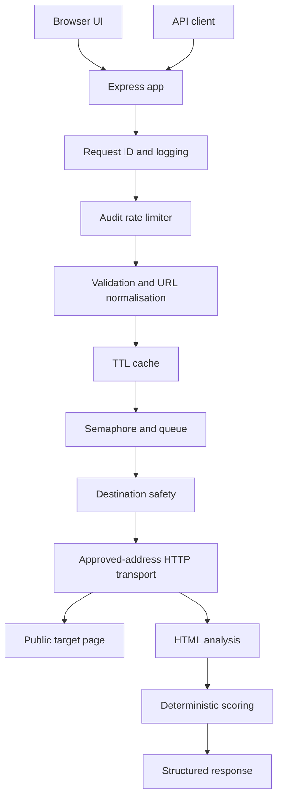

# PagePulse

[](https://github.com/shivaydwivedi/PagePulse/actions/workflows/ci.yml)
[](package.json)
[](LICENSE)
[](https://pagepulse-3gub.onrender.com)

PagePulse is a security-focused server-side web-page audit service for public HTTP and HTTPS pages. It validates destinations with SSRF-aware URL, DNS, IP, and redirect checks, fetches only bounded HTML responses, analyses static markup signals, and returns deterministic project-specific scores through a JSON API and a lightweight public UI.

It is intentionally not Lighthouse, not a browser-rendering engine, and not a Core Web Vitals measurement service. PagePulse reduces SSRF risk with application-level controls, but it does not claim complete SSRF prevention, production SLA, or unlimited scale.

## Live Demo

- Live demo: [https://pagepulse-3gub.onrender.com](https://pagepulse-3gub.onrender.com)
- Repository: [https://github.com/shivaydwivedi/PagePulse](https://github.com/shivaydwivedi/PagePulse)
- Provider: Render
- Hosting: Render Free Web Service
- Status: Implemented

The demo is public and runs on Render Free, so the first request after inactivity may be delayed by a cold start. No uptime or SLA guarantee is claimed.

## Overview

PagePulse accepts a public page URL, normalises it, checks that the resolved destination is safe to contact, fetches one HTML document through an approved-address Undici transport, analyses page metadata and structural signals with Cheerio, scores ten deterministic checks, and returns a sanitized response envelope. The same Express process serves the public UI and the API from one Render Web Service.

The project is built as a portfolio-quality API implementation: explicit request lifecycle, testable service boundaries, structured errors, request IDs, bounded resource use, documentation checks, repository hygiene checks, and CI configuration.

## Why It Is Interesting

- SSRF-aware outbound transport ties DNS validation to the actual addresses used by the request path.
- Redirects are manually followed and revalidated before each next hop.
- Timeouts, response-size limits, cache limits, concurrency limits, queue limits, and rate limits are explicit and configurable.
- Scoring is deterministic and transparent instead of opaque or benchmark-branded.
- The browser UI validates the backend success contract before rendering and safely handles nullable metadata.
- Documentation is checked in CI so stale deployment claims and broken README links fail locally.

## Key Capabilities

- `POST /api/v1/audits` audits public `http:` and `https:` page URLs.
- `GET /healthz` returns a lightweight health envelope.
- Static public UI at `/` with light, dark, and system themes.
- Request IDs in logs, response headers, and JSON envelopes.
- Fixed-window audit rate limiting with `RateLimit-*` and `Retry-After` headers.
- Bounded in-memory TTL cache with `X-Cache: HIT` and `X-Cache: MISS`.
- Bounded semaphore and FIFO queue for cache-miss audits.
- HTML metadata, heading, image, link, viewport, language, and security-header checks.
- Project-specific score, grade, scoring breakdown, check details, and issue catalogue.
- Sanitized public errors for validation, blocked destinations, DNS failures, upstream failures, capacity failures, rate-limit failures, and internal errors.

## Architecture Overview



Primary implementation areas:

- [src/app.js](src/app.js) composes middleware, routers, static UI, and injectable services.
- [src/server.js](src/server.js) starts the HTTP server and handles graceful shutdown.
- [src/services/destination-safety.service.js](src/services/destination-safety.service.js) validates destinations.
- [src/infrastructure/http/audit-http-client.js](src/infrastructure/http/audit-http-client.js) handles safe transport and redirects.
- [src/services/html-analysis.service.js](src/services/html-analysis.service.js) coordinates Cheerio-based analysis.
- [src/scoring/audit-scorer.js](src/scoring/audit-scorer.js) applies scoring policy version `1.0`.

## Audit Request Lifecycle

```text
Request
-> request ID and logging
-> audit rate limiter
-> validation and URL normalisation
-> cache lookup
-> bounded semaphore and queue
-> second cache lookup
-> SSRF-aware destination validation
-> DNS resolution and approved-address transport
-> redirect revalidation
-> bounded response handling
-> HTML analysis
-> deterministic scoring
-> cache storage
-> structured response
```

Short circuits happen early: rate-limit failures stop before body parsing; validation and URL failures stop before cache lookup; cache hits bypass semaphore and outbound transport; capacity failures stop before destination safety and transport.

## Security Model

PagePulse reduces SSRF risk by failing closed unless a submitted URL clearly resolves to a public destination:

- Only `http:` and `https:` schemes are accepted.
- Embedded URL usernames and passwords are rejected.
- `localhost`-style names, literal private IPs, loopback, link-local, multicast, documentation, benchmarking, reserved, unspecified, broadcast, and other special ranges are blocked.
- DNS lookup results are all classified; mixed public/private answers are rejected.
- Redirect targets are normalised, safety-checked, and revalidated before they are followed.
- The Undici dispatcher connects only to addresses approved for the current URL step while preserving the original hostname for host/TLS behaviour.
- A single audit timeout covers destination validation, DNS wait, redirects, request execution, and body streaming.
- Response bodies are capped by `AUDIT_MAX_RESPONSE_BYTES`.
- Only `text/html` and `application/xhtml+xml` responses are analysed.
- Public errors are sanitized and do not expose raw HTML, stack traces, upstream cookies, provider logs, or local paths.
- First-party responses set CSP, nosniff, referrer policy, permissions policy, and frame protection.
- Production responses set `Strict-Transport-Security: max-age=2592000`; local and test responses do not.
- HSTS is intentionally conservative: no preload and no subdomain policy.
- Request IDs are included in logs, response headers, and response envelopes.
- `POST /api/v1/audits` is rate-limited.

Residual limits: application-level checks reduce DNS rebinding and private-network access risk, but they are not a WAF or deployment-level egress policy. Split-horizon DNS, unusual resolver behaviour, platform networking, and future proxy changes require separate review.

## Reliability Controls

- TTL LRU cache: process-local, bounded by TTL and entry count.
- Semaphore: limits active cache-miss audits.
- Queue: bounded FIFO wait queue with timeout.
- Rate limiter: process-local fixed-window buckets with bounded client storage.
- Graceful shutdown: `SIGINT` and `SIGTERM` close the server and use a 10-second forced-exit timeout.
- Logging: structured Pino logs include request IDs and do not log request bodies, response bodies, or full headers.
- Health check: `GET /healthz` is lightweight and does not consume audit quota.
- Render Free limitation: process state resets on restart or cold start.

## Audit Checks And Scoring

Scoring policy version `1.0` uses ten deterministic weighted checks:

| Check | Weight |
| --- | ---: |
| HTTPS | 10 |
| Title | 12 |
| Meta description | 10 |
| Canonical URL | 8 |
| Viewport | 8 |
| HTML language | 8 |
| Headings | 12 |
| Images | 8 |
| Links | 8 |
| Security headers | 16 |

Statuses are `pass`, `warning`, `fail`, and `not_applicable`. Non-applicable checks are excluded from possible points before the final score is normalised to `0-100`. Grades are `A` for 90-100, `B` for 80-89, `C` for 70-79, `D` for 60-69, and `F` below 60.

The score is a PagePulse-specific methodology. It is not comparable to Lighthouse scores, Core Web Vitals, Google ranking signals, or a universal SEO benchmark.

## Technology Stack

- Node.js `>=22 <25`
- Express 5
- JavaScript ES modules
- Zod
- Pino and pino-http
- Undici
- Cheerio
- Vitest and V8 coverage
- Supertest
- ESLint
- GitHub Actions
- Render Web Service

## API Overview

### `GET /healthz`

Returns:

```json
{
  "success": true,
  "requestId": "current-request-id",
  "data": {
    "status": "ok"
  }
}
```

### `POST /api/v1/audits`

Request:

```json
{
  "url": "https://example.com"
}
```

Abbreviated success response:

```json
{
  "success": true,
  "requestId": "current-request-id",
  "data": {
    "auditStatus": "complete",
    "cached": false,
    "score": 82,
    "grade": "B",
    "requestedUrl": "https://example.com/",
    "finalUrl": "https://example.com/",
    "page": {
      "title": "Example Domain",
      "metaDescription": null,
      "canonicalUrl": null,
      "language": "en",
      "headingCount": 1,
      "imageCount": 0,
      "linkCount": 1
    },
    "checks": {},
    "issues": [],
    "scoring": {}
  }
}
```

Abbreviated error response:

```json
{
  "success": false,
  "requestId": "current-request-id",
  "error": {
    "code": "BLOCKED_TARGET",
    "message": "The requested URL resolves to a destination that is not allowed.",
    "details": []
  }
}
```

Every response includes `X-Request-ID`. Audit attempts include rate-limit headers. Successful audit responses include `X-Cache`.

Common public error codes include `VALIDATION_ERROR`, `INVALID_JSON`, `UNSUPPORTED_MEDIA_TYPE`, `INVALID_URL`, `UNSUPPORTED_PROTOCOL`, `URL_CREDENTIALS_BLOCKED`, `BLOCKED_TARGET`, `DNS_LOOKUP_FAILED`, `INVALID_REDIRECT`, `UPSTREAM_TIMEOUT`, `UPSTREAM_CONNECTION_FAILED`, `UPSTREAM_TLS_ERROR`, `UPSTREAM_UNSUPPORTED_CONTENT`, `RESPONSE_TOO_LARGE`, `AUDIT_CAPACITY_EXCEEDED`, `RATE_LIMIT_EXCEEDED`, `RATE_LIMITER_UNAVAILABLE`, `NOT_FOUND`, and `INTERNAL_ERROR`.

Example PowerShell request:

```powershell
curl.exe -i -X POST https://pagepulse-3gub.onrender.com/api/v1/audits `
  -H "Content-Type: application/json" `
  -H "X-Request-ID: demo-request-1" `
  -d '{\"url\":\"https://example.com\"}'
```

Example local Bash request:

```bash
curl -i -X POST http://localhost:3000/api/v1/audits \
  -H "Content-Type: application/json" \
  -H "X-Request-ID: local-request-1" \
  -d '{"url":"https://example.com"}'
```

## Local Development

Prerequisites:

- Node.js `>=22 <25`
- npm
- Git

Install and run locally:

```powershell
npm ci
npm run dev
```

Useful verification commands:

```powershell
npm test
npm run lint
npm run coverage
npm run ci
```

`npm run dev` uses Node's `--env-file-if-exists=.env` support and loads a local `.env` when present. `npm start` runs `node src/server.js` and does not automatically load `.env`; production variables are provided by the hosting platform.

Create local environment values from the example file:

```powershell
Copy-Item .env.example .env
```

## Environment Configuration

All values are optional because the schema supplies defaults. Current production deployment sets `NODE_ENV=production`, may tune memory-related audit limits for Render Free, and relies on Render-managed `PORT`.

| Name | Default | Purpose |
| --- | --- | --- |
| `NODE_ENV` | `development` | Runtime mode: `development`, `test`, or `production` |
| `PORT` | `3000` | HTTP port; Render supplies this automatically |
| `LOG_LEVEL` | `info` | Pino log level |
| `REQUEST_BODY_LIMIT` | `16kb` | Audit JSON body limit |
| `AUDIT_TIMEOUT_MS` | `8000` | Total outbound audit timeout |
| `AUDIT_MAX_REDIRECTS` | `5` | Manual redirect limit |
| `AUDIT_MAX_RESPONSE_BYTES` | `1048576` | Maximum retained upstream response bytes |
| `AUDIT_USER_AGENT` | `PagePulseBot/1.0` | Outbound User-Agent |
| `AUDIT_CACHE_ENABLED` | `true` | Enables process-local audit cache |
| `AUDIT_CACHE_TTL_MS` | `300000` | Cache TTL |
| `AUDIT_CACHE_MAX_ENTRIES` | `500` | Cache entry limit |
| `AUDIT_MAX_CONCURRENT` | `5` | Active cache-miss audit limit |
| `AUDIT_MAX_QUEUE_SIZE` | `50` | Waiting audit queue limit |
| `AUDIT_QUEUE_TIMEOUT_MS` | `2000` | Queue wait timeout |
| `AUDIT_RATE_LIMIT_ENABLED` | `true` | Enables audit rate limiting |
| `AUDIT_RATE_LIMIT_WINDOW_MS` | `60000` | Fixed-window duration |
| `AUDIT_RATE_LIMIT_MAX_REQUESTS` | `30` | Audit attempts per client per window |
| `AUDIT_RATE_LIMIT_MAX_CLIENTS` | `10000` | In-memory rate-limit bucket limit |
| `TRUST_PROXY` | `false` | Express proxy trust for client IP resolution |

`TRUST_PROXY` remains unset on Render. Current rate limiting therefore uses the direct Render proxy-facing address behaviour. Proxy-aware per-end-user client identity requires a separately verified deployment topology and spoofing review.

## Testing And Quality

Local quality gates:

```powershell
npm run lint
npm test
npm run coverage
npm run check
npm run check:docs
npm run check:hygiene
npm run ci
npm audit --audit-level=high
npm ls --depth=0
git diff --check
```

The current suite includes unit and integration tests for validation, destination safety, transport, HTML analysis, scoring, caching, concurrency, rate limiting, UI validation/rendering, repository hygiene, documentation structure, and security headers.

Latest local Phase 12 verification: 43 Vitest files and 285 tests passed. Coverage reported statements 92.99%, branches 91.96%, functions 96.51%, and lines 93%.

## Continuous Integration

The GitHub Actions workflow `CI` runs on pushes to `main`, pull requests targeting `main`, and manual dispatch. It installs with `npm ci`, runs lint, coverage, documentation checks, repository hygiene checks, dependency tree validation, high-severity dependency audit, whitespace checks, and final tracked-file checks. The workflow does not deploy PagePulse.

Coverage thresholds are enforced across `src/**/*.js`: statements 90%, branches 85%, functions 90%, and lines 90%.

Recommended branch protection for `main`: require pull requests, require the CI status check before merging, require branches to be up to date before merging, block force pushes, block branch deletion, and require conversation resolution.

## Deployment

PagePulse is implemented on Render as one Web Service:

- Repository: `shivaydwivedi/PagePulse`
- Branch: `main`
- Runtime: Node
- Root directory: repository root
- Build command: `npm ci`
- Start command: `npm start`
- Health check: `/healthz`
- Instance type: Free
- Auto-deploy: enabled from `main`
- HTTPS: Render-managed
- `PORT`: Render-managed and observed as `10000`
- Database, persistent disk, worker, cron, Redis, and Cloudinary: not used
- UI and API: same-origin Express service

Production verification is documented in [docs/deployment/production-verification-report.md](docs/deployment/production-verification-report.md). Operations and rollback guidance is in [docs/deployment/operations-and-rollback.md](docs/deployment/operations-and-rollback.md).

## Known Limitations

- Render Free cold starts may delay the first request after inactivity.
- Cache, rate limiter, semaphore, and queue state are process-local and reset on restart.
- `TRUST_PROXY` is unset; per-end-user rate limiting behind Render's proxy requires separately verified proxy topology.
- No database, saved report history, accounts, or authentication.
- No browser rendering, JavaScript execution, Core Web Vitals, or production field performance measurement.
- SSRF controls reduce risk but do not replace platform egress controls or a WAF.
- The public UI is a demonstration interface, not a full product dashboard.

## Future Improvements

- Add verified proxy-aware client identity if deployment topology is proven.
- Add shared cache and distributed rate limiting for multi-instance deployments.
- Add saved reports and authenticated quotas if product requirements expand.
- Add production Lighthouse or field-data monitoring as a separate measurement feature.
- Add a rendered documentation publishing pipeline for Mermaid diagrams.

## Screenshots


## Documentation Index

- [Architecture index](docs/architecture/README.md)
- [System overview](docs/architecture/system-overview.md)
- [Request lifecycle](docs/architecture/request-lifecycle.md)
- [Security architecture](docs/architecture/security-architecture.md)
- [Transport architecture](docs/architecture/transport-architecture.md)
- [Analysis and scoring](docs/architecture/analysis-and-scoring.md)
- [Caching and concurrency](docs/architecture/caching-and-concurrency.md)
- [Rate limiting](docs/architecture/rate-limiting.md)
- [Observability and errors](docs/architecture/observability-and-errors.md)
- [CI and quality gates](docs/architecture/ci-and-quality-gates.md)
- [Architecture decisions](docs/architecture/architecture-decisions.md)
- [Deployment guide](docs/deployment/README.md)
- [Render configuration](docs/deployment/render-configuration.md)
- [Production environment](docs/deployment/production-environment.md)
- [Production verification report](docs/deployment/production-verification-report.md)
- [Post-deployment checklist](docs/deployment/post-deployment-verification.md)
- [Operations and rollback](docs/deployment/operations-and-rollback.md)
- [Performance report](docs/performance/lighthouse-report.md)
- [Diagram catalogue](docs/diagrams/README.md)

## License

PagePulse is released under the [MIT License](LICENSE).

## Digital Heroes Training Attribution

Built for [Digital Heroes Training Task](https://digitalheroesco.com).

## AI Usage Disclosure

Development was assisted by AI coding tools under human direction and review. The repository content, implementation decisions, and verification results should be evaluated against the code and tests in this project rather than treated as claims of external certification.
