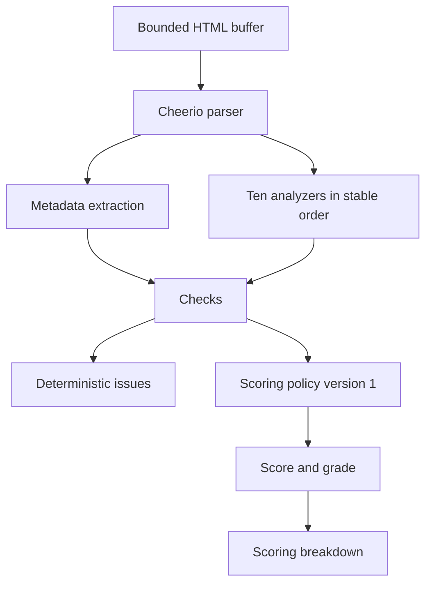

# Analysis And Scoring

Status: Implemented

PagePulse parses bounded HTML with Cheerio and calculates a deterministic project-specific score. It does not run Lighthouse, does not measure Core Web Vitals, does not measure LCP of audited websites, and is not a universal SEO score.

Back to the [architecture index](README.md). Diagram source: [analysis-and-scoring-flow.mmd](../diagrams/analysis-and-scoring-flow.mmd).

## Analysis

[src/services/html-analysis.service.js](../../src/services/html-analysis.service.js) receives the bounded transport result and parses the returned HTML with Cheerio. It extracts page metadata, stable checks, and deterministic issues. It does not fetch linked resources, execute scripts, load CSS, or render the page in a browser.

Public text fields are bounded with Unicode-safe helpers so truncation does not split surrogate pairs. Canonical URLs are validated, unsupported protocols and credentials are treated as unsafe, and overly long public canonical values are returned as `null` rather than partially exposed.

## Checks

The scoring policy uses ten checks in stable order:

| Check | Weight |
| --- | ---: |
| `https` | 10 |
| `title` | 12 |
| `metaDescription` | 10 |
| `canonical` | 8 |
| `viewport` | 8 |
| `htmlLang` | 8 |
| `headings` | 12 |
| `images` | 8 |
| `links` | 8 |
| `securityHeaders` | 16 |

## Scoring

[src/scoring/scoring-policy.js](../../src/scoring/scoring-policy.js) defines policy version `1.0`. Status multipliers are `pass: 1`, `warning: 0.5`, and `fail: 0`. `not_applicable` checks are excluded from possible points, so scoring normalises around checks that apply to the page.

Grade boundaries are:

| Minimum score | Grade |
| ---: | --- |
| 90 | A |
| 80 | B |
| 70 | C |
| 60 | D |
| 0 | F |

[src/scoring/audit-scorer.js](../../src/scoring/audit-scorer.js) validates the generated check structure before returning score, grade, earned points, possible points, excluded points, and breakdown. Issue generation remains independent from numeric scoring.

## Diagram

