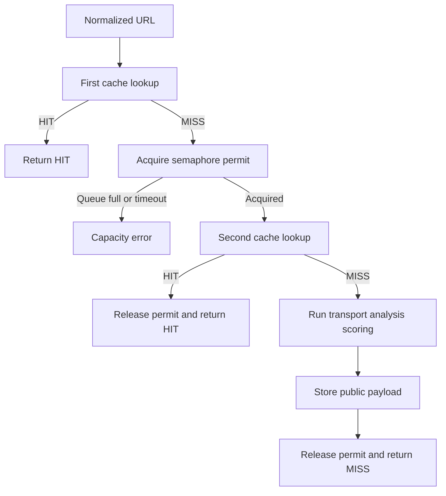

# Caching And Concurrency

Status: Implemented

PagePulse uses a bounded in-memory TTL cache and a bounded in-memory semaphore to avoid repeated work and control concurrent cache-miss audits.

Back to the [architecture index](README.md). Diagram source: [cache-concurrency-flow.mmd](../diagrams/cache-concurrency-flow.mmd).

## Cache

The cache key is the normalised audit URL. Only completed public-safe audit payloads are cached. Request IDs are not cached, response envelopes are not cached, raw HTML is not cached, and transport internals are not cached.

[src/infrastructure/cache/ttl-cache.js](../../src/infrastructure/cache/ttl-cache.js) uses non-sliding TTL, lazy expiry, bounded max entries, and least-recently-used eviction. Values are cloned on read and write to protect cached data from caller mutation. Malformed cached payloads are discarded and treated as misses. Cache read and write failures fail open so a valid audit can still complete.

`X-Cache: MISS` is emitted when a fresh audit completes. `X-Cache: HIT` is emitted when a cached payload is returned. Completed HTML audits can be cached even when the target page itself returns HTTP status such as 404 or 500, because the audit completed successfully.

## Concurrency

[src/infrastructure/concurrency/audit-semaphore.js](../../src/infrastructure/concurrency/audit-semaphore.js) bounds active cache-miss audits with `AUDIT_MAX_CONCURRENT`, a FIFO wait queue, `AUDIT_MAX_QUEUE_SIZE`, and `AUDIT_QUEUE_TIMEOUT_MS`. Waiting is abort-aware. Permit release is idempotent and happens in a `finally` path in [src/services/audit.service.js](../../src/services/audit.service.js).

Cache hits bypass the semaphore. Cache misses perform a second cache lookup after acquiring the permit so a waiting request can reuse work completed by an earlier request.

## Limitations

Cache and semaphore state are process-local. They reset on restart and are not shared across multiple instances.

## Diagram

