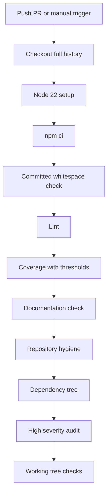

# CI And Quality Gates

Status: Implemented

Phase 9 configures GitHub Actions and repository quality gates. The workflow is local repository configuration until it is proven by the first GitHub run.

Back to the [architecture index](README.md). Diagram source: [ci-quality-flow.mmd](../diagrams/ci-quality-flow.mmd).

## Workflow

[.github/workflows/ci.yml](../../.github/workflows/ci.yml) defines workflow `CI` for pull requests targeting `main`, pushes to `main`, and manual dispatch. It uses `ubuntu-latest`, Node.js 22, `npm ci`, read-only `contents: read` permissions, `actions/checkout@v4`, `actions/setup-node@v4`, npm cache keyed by `package-lock.json`, and concurrency cancellation.

The workflow does not deploy and does not use `pull_request_target`.

## Quality Gates

- Committed-diff whitespace validation for pull requests, pushes, and manual runs.
- ESLint through `npm run lint`.
- Complete Vitest coverage run through `npm run coverage`.
- Global coverage thresholds across `src/**/*.js`: statements 90, branches 85, functions 90, lines 90.
- Documentation structure validation through `npm run check:docs`.
- Repository hygiene through `npm run check:hygiene`.
- Dependency tree verification through `npm ls --depth=0`.
- High-severity dependency audit through `npm audit --audit-level=high`.
- Post-command working-tree whitespace check through `git diff --check`.
- Dependency manifest mutation check for `package.json` and `package-lock.json`.
- Final `git status --short` check.

## Repository Support Files

Dependabot is configured in [.github/dependabot.yml](../../.github/dependabot.yml) for npm and GitHub Actions. Pull request and issue templates guide review quality without adding automation privileges.

## Branch Protection Recommendation

After the first remote CI run succeeds, protect `main` by requiring pull requests, the CI status check, up-to-date branches, blocked force pushes, blocked deletion, and conversation resolution.

## Diagram

