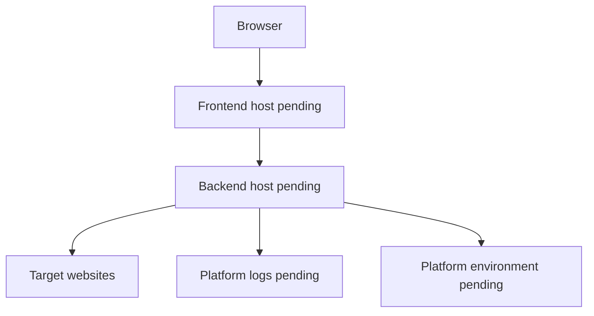

# Future Deployment Architecture

Status: Planned

This is a planning document. PagePulse is not deployed in the current phase, and no hosting provider has been selected.

Back to the [architecture index](README.md).

## Decisions Still Required

- Frontend hosting.
- Backend hosting.
- HTTPS termination.
- API origin and CORS policy.
- `TRUST_PROXY` value for the chosen platform.
- Production environment-variable management.
- Process health checks.
- Production cache, concurrency, and rate-limit values.
- Log collection and retention.
- Platform request timeouts.
- Cold-start tolerance.
- Horizontal scaling strategy.

## Production Concerns

The current cache, semaphore, and rate limiter are process-local. A single-process deployment can use them directly. A horizontally scaled deployment would need shared cache and distributed rate limiting if consistent cross-instance behaviour is required.

Deployment must preserve outbound SSRF safety with platform-level network controls where available. It must also configure environment variables directly through the hosting platform rather than committing `.env` files.

## Preliminary Planned Flow

