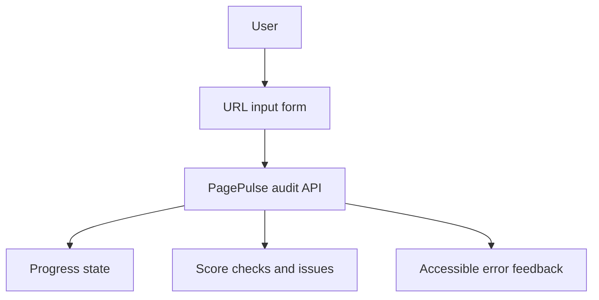

# Frontend Architecture

Status: Implemented

Phase 10 implements the public demo UI with plain HTML, CSS, and browser JavaScript. Phase 10B records local Lighthouse lab measurements. No frontend framework, bundler, web-font package, chart library, or external runtime dependency is used.

Back to the [architecture index](README.md).

## Implemented Design

- `GET /` serves [public/index.html](../../public/index.html).
- Static assets are served from [public](../../public) by the existing Express app.
- The UI calls `POST /api/v1/audits` through a same-origin relative URL.
- Browser state is explicit: idle, loading, success, and error.
- Light, dark, and system themes use CSS custom properties.
- Explicit theme choice is stored as `pagepulse.theme`; the last submitted URL is stored as `pagepulse.lastUrl`.
- Result rendering uses safe DOM methods rather than HTML string interpolation.
- Checks are displayed in the API scoring order.
- Errors show safe public messages, request IDs where available, and retry guidance.
- Rate-limit errors show a whole-second retry countdown capped at one hour.
- The footer visibly includes `Built for Digital Heroes Training Task`.

## Performance Verification

The UI is LCP-conscious by construction: main heading and form are in initial HTML, JavaScript is loaded as a module, no remote fonts or external scripts are used, and no large raster assets are added.

Phase 10B measured the initial public UI with Lighthouse mobile navigation on a local `npm start` server. The median of three local runs recorded Performance 100, Accessibility 100, Best Practices 96, SEO 100, LCP 1.160 seconds, and CLS 0. Full conditions and limitations are documented in [docs/performance/lighthouse-report.md](../performance/lighthouse-report.md).

These are lab measurements only. They are not production field data and should be repeated after deployment.

## Accessibility Approach

The page includes semantic landmarks, a skip link, visible labels, keyboard-accessible controls, focus states, `aria-live` status areas, `aria-busy` loading state, reduced-motion CSS, and text labels alongside status colours.

## Known Limitations

- No deployed frontend exists yet.
- No screenshots are committed.
- Production Lighthouse, accessibility, and mobile performance measurement are pending until deployment exists.
- The UI intentionally does not render target pages or measure Core Web Vitals.

## UI Flow

