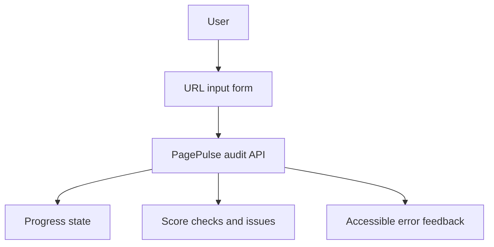

# Future Frontend Architecture

Status: Planned

This is a planning document. The public frontend is not implemented, the frontend framework decision is pending, and no Lighthouse measurement has been completed.

Back to the [architecture index](README.md).

## Intended Goals

- Lightweight public UI for submitting a URL to the audit API.
- Responsive layout for desktop and mobile.
- URL input form with clear validation and error states.
- Audit progress state while the backend request is running.
- Score and grade display.
- Check and issue presentation that remains readable without heavy charting.
- Accessible keyboard and screen-reader behaviour.
- Required visible footer credit: `Built for Digital Heroes Training Task`.
- Minimal JavaScript and minimal font loading, preferably system fonts unless a later design phase justifies otherwise.
- API error handling for validation, blocked targets, capacity, rate limits, transport failures, and internal failures.
- User feedback for `RATE_LIMIT_EXCEEDED` and `AUDIT_CAPACITY_EXCEEDED`.

## Performance Targets

The intended public page should target LCP below 2.5 seconds under an agreed Lighthouse mobile test, with careful CLS and INP handling. This target has not been measured because the frontend does not exist yet.

## Open Decisions

- Frontend framework decision pending.
- Hosting model pending.
- API origin and CORS policy pending.
- Final visual design pending.
- Whether any client-side routing is needed is pending.

## Preliminary Planned Flow

