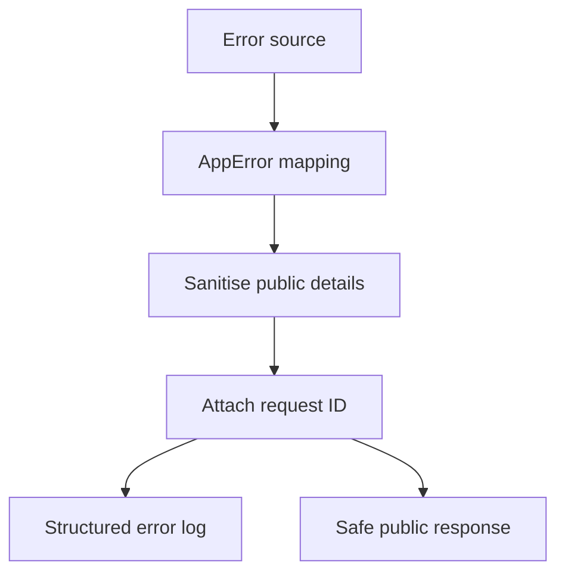

# Observability And Errors

Status: Implemented

PagePulse uses request IDs, structured logs, and safe public error envelopes to make API behaviour traceable without exposing internal implementation detail.

Back to the [architecture index](README.md). Diagram source: [error-handling-flow.mmd](../diagrams/error-handling-flow.mmd).

## Request IDs And Logs

[src/middleware/request-id.middleware.js](../../src/middleware/request-id.middleware.js) accepts safe `X-Request-ID` values or generates a new ID. The ID is attached to `req.id`, returned in `X-Request-ID`, included in response envelopes, and added to request-scoped logs.

[src/infrastructure/logging/logger.js](../../src/infrastructure/logging/logger.js) configures Pino and pino-http. Test logs are disabled. Request and response bodies are not logged by the request logger.

## Error Handling

[src/middleware/error.middleware.js](../../src/middleware/error.middleware.js) maps thrown values through [src/utils/errors.js](../../src/utils/errors.js), logs internal error context, and returns a sanitized public envelope. Public responses do not expose stack traces or raw causes.

## Error Catalogue

| Status | Code | Broad source | Retry may help |
| ---: | --- | --- | --- |
| 400 | `VALIDATION_ERROR` | Request body validation | No |
| 400 | `INVALID_JSON` | JSON parser | No |
| 400 | `INVALID_URL` | URL parsing | No |
| 400 | `UNSUPPORTED_PROTOCOL` | URL policy | No |
| 400 | `URL_CREDENTIALS_BLOCKED` | URL policy | No |
| 400 | `UNSUPPORTED_MEDIA_TYPE` | Content-type policy | No |
| 400 | `BLOCKED_TARGET` | Destination safety | No |
| 404 | `NOT_FOUND` | Router | No |
| 422 | `UPSTREAM_UNSUPPORTED_CONTENT` | Upstream content policy | Maybe with another URL |
| 429 | `RATE_LIMIT_EXCEEDED` | Audit rate limiter | Yes after `Retry-After` |
| 500 | `INTERNAL_ERROR` | Unexpected internal error or scoring validation | Maybe |
| 502 | `DNS_LOOKUP_FAILED` | DNS resolution | Maybe |
| 502 | `UPSTREAM_CONNECTION_FAILED` | Outbound transport | Maybe |
| 502 | `UPSTREAM_TLS_ERROR` | Outbound transport | Maybe |
| 502 | `INVALID_REDIRECT` | Redirect handling | Maybe with another URL |
| 502 | `TOO_MANY_REDIRECTS` | Redirect handling | Maybe with another URL |
| 502 | `RESPONSE_TOO_LARGE` | Body-size enforcement | No |
| 502 | `UPSTREAM_REQUEST_FAILED` | Outbound transport | Maybe |
| 503 | `AUDIT_CAPACITY_EXCEEDED` | Semaphore capacity | Yes |
| 503 | `RATE_LIMITER_UNAVAILABLE` | Rate limiter safety | Yes |
| 504 | `UPSTREAM_TIMEOUT` | Outbound transport | Maybe |

## Diagram

