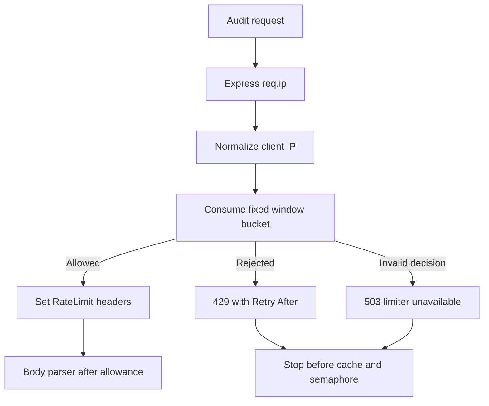

# Rate Limiting

Status: Implemented

PagePulse applies fixed-window rate limiting only to `POST /api/v1/audits`. Health, API root, unknown routes, unrelated paths, and `OPTIONS` requests are not rate-limited.

Back to the [architecture index](README.md). Diagram source: [rate-limit-flow.mmd](../diagrams/rate-limit-flow.mmd).

## Middleware Order

The audit limiter runs before route-specific body parsing. This means malformed JSON, unsupported audit media types, ordinary validation failures, blocked targets, cache hits, capacity failures, and successful audits all consume quota.

Already rejected requests bypass JSON parsing, content-type validation, cache lookup, semaphore acquisition, DNS, transport, analysis, and scoring.

## Client Identity

[src/middleware/audit-rate-limit.middleware.js](../../src/middleware/audit-rate-limit.middleware.js) uses Express `req.ip`. [src/utils/client-identity.js](../../src/utils/client-identity.js) trims and normalises client keys, maps IPv4-mapped IPv6 addresses such as `::ffff:127.0.0.1` to plain IPv4, and falls back to `unknown-client` when no usable IP exists.

`TRUST_PROXY` accepts `false`, `true`, or integer hop counts `0` through `10`. Incorrect proxy trust configuration can allow spoofing or incorrect bucket assignment, so deployment must set it deliberately.

## Fixed Window

[src/infrastructure/rate-limit/fixed-window-rate-limiter.js](../../src/infrastructure/rate-limit/fixed-window-rate-limiter.js) starts a fixed window on the first request for a client. Allowed and rejected requests do not slide the reset time. Client storage is bounded by `AUDIT_RATE_LIMIT_MAX_CLIENTS`; when necessary, the least-recently-seen bucket is evicted.

## Public Contract

Allowed audit attempts receive `RateLimit-Limit`, `RateLimit-Remaining`, and `RateLimit-Reset`. Rejected attempts return `429 RATE_LIMIT_EXCEEDED` and include `Retry-After`. Malformed injected limiter decisions or limiter exceptions fail closed as `503 RATE_LIMITER_UNAVAILABLE` without rate-limit headers.

## Limitations

Rate limiting is in-memory and per-process. It is not an API-key system, authentication layer, distributed quota service, DDoS defense, or WAF.

## Diagram

