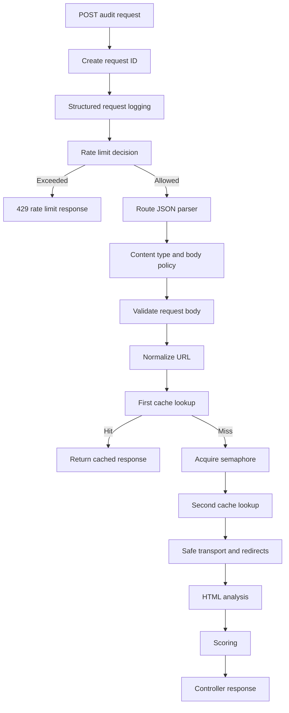

# Audit Request Lifecycle

Status: Implemented

This document describes the exact current lifecycle for `POST /api/v1/audits`.

Back to the [architecture index](README.md). Diagram source: [audit-request-lifecycle.mmd](../diagrams/audit-request-lifecycle.mmd).

## Ordered Path

1. Request ID creation in [src/middleware/request-id.middleware.js](../../src/middleware/request-id.middleware.js).
2. Structured request logging in [src/infrastructure/logging/logger.js](../../src/infrastructure/logging/logger.js).
3. Rate-limit decision in [src/middleware/audit-rate-limit.middleware.js](../../src/middleware/audit-rate-limit.middleware.js).
4. Route-specific JSON parsing in [src/routes/audit.routes.js](../../src/routes/audit.routes.js).
5. Content-type and body policy in [src/routes/audit.routes.js](../../src/routes/audit.routes.js).
6. Request validation in [src/validators/audit.validator.js](../../src/validators/audit.validator.js).
7. URL normalisation in [src/utils/normalize-url.js](../../src/utils/normalize-url.js).
8. First cache lookup in [src/services/audit.service.js](../../src/services/audit.service.js).
9. Semaphore acquisition on cache miss.
10. Second cache lookup after waiting.
11. Destination safety and DNS validation.
12. Safe transport and redirect handling.
13. HTML analysis.
14. Scoring.
15. Safe cache storage.
16. Permit release in `finally`.
17. Controller response with a success envelope.
18. Central error response when any stage throws.

## Short-Circuit Paths

- `429 RATE_LIMIT_EXCEEDED` happens before body parsing, content-type checks, cache, semaphore, DNS, transport, analysis, or scoring.
- Malformed JSON consumes quota, receives rate-limit headers, and returns `INVALID_JSON`.
- Unsupported audit media consumes quota, receives rate-limit headers, and returns `UNSUPPORTED_MEDIA_TYPE`.
- Validation and URL normalisation failures stop before cache lookup.
- Cache hits return without semaphore acquisition or outbound transport.
- Capacity failures return `AUDIT_CAPACITY_EXCEEDED` without transport.
- Blocked targets, DNS failures, transport failures, analyser failures, and scorer failures use the central error middleware.

## Headers

Every response receives `X-Request-ID`. Successful audit responses receive `X-Cache: HIT` or `X-Cache: MISS`. Rate-limited audit attempts receive `RateLimit-Limit`, `RateLimit-Remaining`, and `RateLimit-Reset`; rejected 429 responses also receive `Retry-After`.

## Diagram

