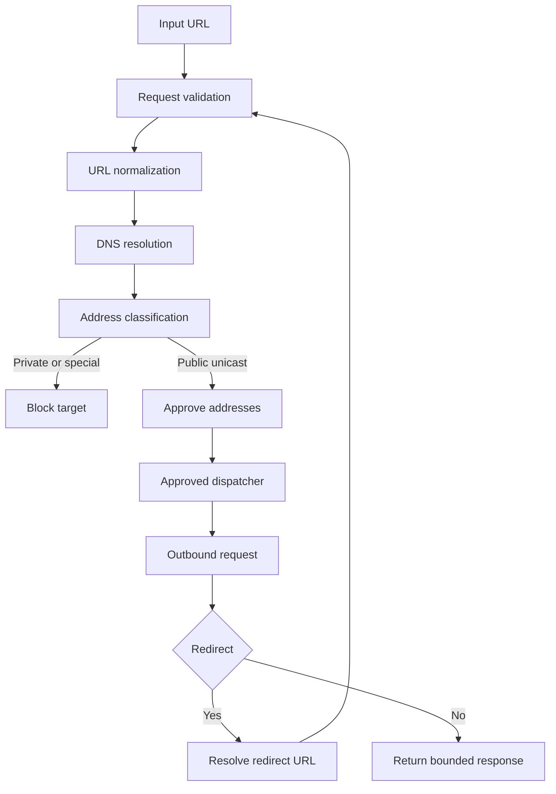

# Security Architecture

Status: Implemented

PagePulse treats audit URLs, request bodies, upstream responses, and cached payloads as untrusted data. The main security boundary is between the API process and arbitrary target websites.

Back to the [architecture index](README.md). Diagram source: [ssrf-protection-flow.mmd](../diagrams/ssrf-protection-flow.mmd).

## Trust Boundary

The API client supplies a URL. PagePulse validates and normalises the URL, resolves the destination, blocks private/local/special addresses, pins outbound connections to approved addresses, and revalidates redirects before every subsequent request.

## Threats And Controls

| Threat | Protection | Residual limitation |
| --- | --- | --- |
| Private network SSRF | IP classification blocks private, local, loopback, multicast, link-local, and special ranges | Application checks reduce risk but are not a WAF or network egress policy |
| DNS rebinding | Destination is validated before each request and dispatcher connects to approved addresses | Some deployment-network behaviours still need platform-level review |
| Credential leakage in URLs | URL credentials are rejected during normalisation | Future input fields must keep this policy |
| Redirect to blocked target | Redirect location is normalised and revalidated | Redirect behaviour depends on current configured limit |
| Oversized upstream body | Content length and streamed byte limits are enforced | Compressed responses are avoided with identity encoding |
| Unsupported content | Only supported HTML content types continue to analysis | Content sniffing is intentionally limited |
| Raw HTML exposure | Raw body and unsafe headers are excluded from public responses and cache payloads | Future response additions must preserve this boundary |
| Error detail leakage | Public envelopes use sanitized `AppError` fields | Logs retain internal causes for operators |
| Abuse of audit endpoint | Fixed-window rate limiting and semaphore bounds protect local resources | Not a DDoS defense or distributed WAF |
| Browser-facing response handling | Manual security headers add CSP, nosniff, referrer policy, permissions policy, frame protection, and production-only HSTS | HSTS is conservative and does not include preload or subdomains |
| Secret file commits | `.gitignore`, CI hygiene, and contribution docs block common tracked paths | Not complete secret scanning |

## Implemented Controls

Strict scheme policy accepts only HTTP and HTTPS. IPv4 and IPv6 addresses are parsed and classified through the IP utilities. DNS failures map to `DNS_LOOKUP_FAILED`; blocked destinations map to `BLOCKED_TARGET`. The approved-address dispatcher prevents Undici from silently connecting to a newly resolved address that was not approved.

Environment secrets should be provided through `.env` locally or platform environment variables in production. `.env` files are ignored and `.env.example` is the only committed env template.

CI runs high-severity `npm audit`, repository hygiene checks, committed whitespace checks, and dependency tree validation.

First-party responses set `Content-Security-Policy`, `X-Content-Type-Options: nosniff`, `Referrer-Policy`, `Permissions-Policy`, and frame protection. The CSP permits same-origin CSS, module JavaScript, images, API calls, and the existing inline theme bootstrap. It does not require external runtime assets. Production responses also set `Strict-Transport-Security: max-age=2592000`; local development and test responses do not set HSTS.

`TRUST_PROXY` status for Render: left unset. There is insufficient evidence to configure a specific trusted proxy hop count safely, so current rate limiting uses the direct Render proxy-facing address behaviour. Proxy-aware per-end-user client identity requires separately verified deployment topology and spoofing checks. Do not add permanent raw forwarding-header logging or a public diagnostic endpoint.

## Diagram

