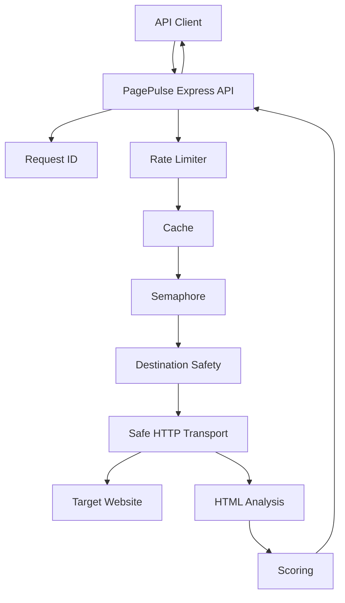

# System Overview

Status: Implemented

PagePulse is a Node.js 22 Express API that accepts an audit request from an API client, safely fetches one HTML page, analyses bounded page signals, scores the result, and returns a sanitized JSON envelope. The current system has no database and keeps cache, concurrency, and rate-limit state in process memory.

Back to the [architecture index](README.md). Diagram source: [system-context.mmd](../diagrams/system-context.mmd).

## Components

| Component | Source | Responsibility |
| --- | --- | --- |
| Express app | [src/app.js](../../src/app.js) | Composes middleware, routers, and injectable services |
| Server entrypoint | [src/server.js](../../src/server.js) | Starts HTTP server and handles graceful shutdown |
| Request ID middleware | [src/middleware/request-id.middleware.js](../../src/middleware/request-id.middleware.js) | Accepts safe request IDs or generates new IDs |
| Structured logging | [src/infrastructure/logging/logger.js](../../src/infrastructure/logging/logger.js) | Creates Pino logger and request logging integration |
| Audit route | [src/routes/audit.routes.js](../../src/routes/audit.routes.js) | Applies audit-only rate limit, JSON parser, and content policy |
| Audit controller | [src/controllers/audit.controller.js](../../src/controllers/audit.controller.js) | Builds the success response and `X-Cache` header |
| Audit service | [src/services/audit.service.js](../../src/services/audit.service.js) | Coordinates validation, cache, semaphore, transport, analysis, scoring, and storage |
| Destination safety | [src/services/destination-safety.service.js](../../src/services/destination-safety.service.js) | Resolves and classifies destination addresses |
| Safe HTTP client | [src/infrastructure/http/audit-http-client.js](../../src/infrastructure/http/audit-http-client.js) | Uses Undici with approved-address dispatch and redirect revalidation |
| HTML analysis | [src/services/html-analysis.service.js](../../src/services/html-analysis.service.js) | Parses bounded HTML with Cheerio and produces checks/issues |
| Scoring | [src/scoring/audit-scorer.js](../../src/scoring/audit-scorer.js) | Applies scoring policy version 1.0 |

## Responsibility Boundaries

The API layer owns HTTP routing, headers, request IDs, parsing, and public envelopes. The service layer owns audit orchestration and cache/semaphore coordination. Destination safety and transport are separate so URL approval is performed before each outbound connection. Analysis and scoring do not fetch linked resources.

## Process-Local State

The TTL cache, semaphore, and fixed-window rate limiter are process-local. They reset on process restart and are not shared across horizontally scaled instances.

## Current Limitations

PagePulse is not deployed in this phase, does not include a public UI, does not use a database, and does not provide distributed cache or distributed rate limiting. CI is configured locally but remote GitHub execution must be proven after the first push or pull request.
