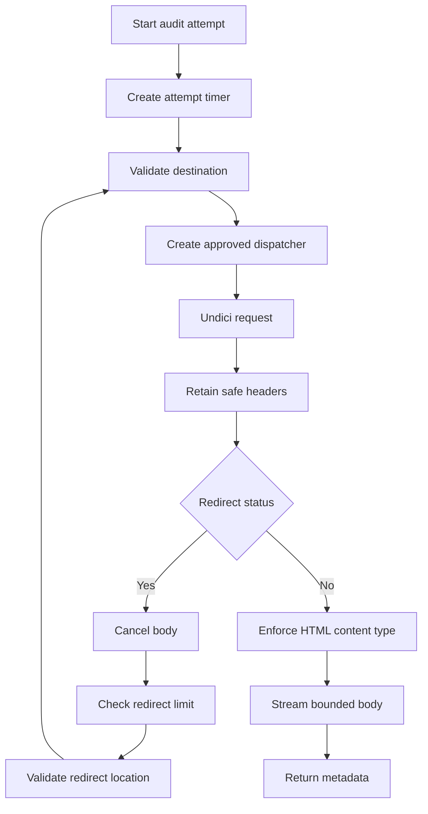

# Transport Architecture

Status: Implemented

PagePulse uses Undici for outbound HTTP requests, wrapped by destination validation, approved-address dispatch, manual redirect handling, and bounded body reading.

Back to the [architecture index](README.md). Diagram source: [transport-and-redirect-flow.mmd](../diagrams/transport-and-redirect-flow.mmd).

## Flow

The audit HTTP client in [src/infrastructure/http/audit-http-client.js](../../src/infrastructure/http/audit-http-client.js) creates a total attempt timer, validates the current URL through [src/services/destination-safety.service.js](../../src/services/destination-safety.service.js), creates an approved-address dispatcher, and sends an Undici `GET` with redirects disabled.

For redirect status codes, PagePulse cancels the current body, validates the `Location`, enforces `AUDIT_MAX_REDIRECTS`, and repeats destination safety before the next request. The original hostname is preserved for HTTP Host and TLS server-name behaviour while the dispatcher pins connections to approved addresses.

## Bounds And Cleanup

The client enforces `AUDIT_TIMEOUT_MS`, `AUDIT_MAX_RESPONSE_BYTES`, supported HTML content types, safe retained headers, abort propagation, dispatcher cleanup, and timer cleanup. Response bodies are cancelled when a redirect or content rejection makes them unnecessary.

## Public Error Categories

| Code | Meaning |
| --- | --- |
| `DNS_LOOKUP_FAILED` | Destination hostname could not be resolved safely |
| `BLOCKED_TARGET` | Destination resolved to a blocked address or unsafe target |
| `UPSTREAM_TIMEOUT` | Total audit attempt timed out |
| `UPSTREAM_CONNECTION_FAILED` | Connection could not be established |
| `UPSTREAM_TLS_ERROR` | TLS negotiation failed |
| `INVALID_REDIRECT` | Redirect was missing, malformed, unsupported, or unsafe |
| `TOO_MANY_REDIRECTS` | Redirect count exceeded configuration |
| `RESPONSE_TOO_LARGE` | Content length or streamed body exceeded the byte limit |
| `UPSTREAM_UNSUPPORTED_CONTENT` | Upstream response was not a supported HTML content type |
| `UPSTREAM_REQUEST_FAILED` | Other outbound request failure |

## Diagram

